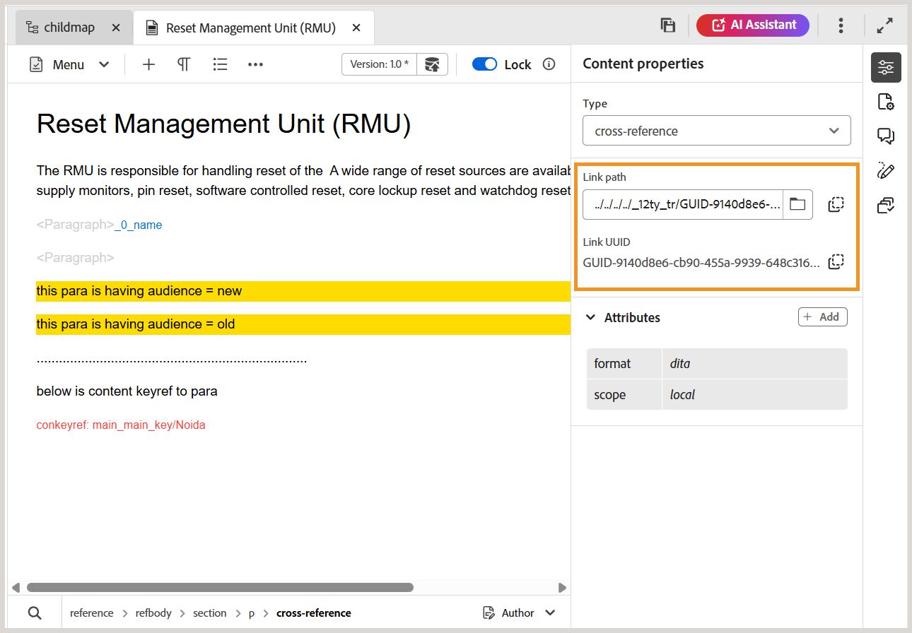

# Rechtes Bedienfeld im Editor

Das rechte Bedienfeld enthält Informationen zum aktuell ausgewählten Dokument.

>[!NOTE]
>
> Die Größe des rechten Bedienfelds kann geändert werden. Um die Größe des Bereichs zu ändern, bringen Sie den Cursor auf die Bereichsbegrenzung, der Cursor ändert sich in einen Doppelpfeil, wählen Sie und ziehen Sie, um die Größe des Bereichs zu ändern.

Das rechte Bedienfeld bietet Zugriff auf die folgenden Funktionen:

- [Inhaltseigenschaften](#content-properties)
- [Dateieigenschaften](#file-properties)
- [Überprüfung](#review)
- [Änderungen verfolgen](#track-changes)
- [Ingenieur](#schematron)

## Inhaltseigenschaften

Sie können auf die Funktion **Inhaltseigenschaften** zugreifen, indem Sie im rechten Bedienfeld auf **Inhaltseigenschaften** klicken. Das Bedienfeld **Inhaltseigenschaften** enthält Informationen zum Typ des aktuell im Dokument ausgewählten Elements und zu dessen Attributen.

Bei referenzierten Inhalten zeigt das Bedienfeld auch die Optionen **Link-Pfad** und **Link-UUID** an, mit denen Sie den ausgewählten Verweis identifizieren und kopieren können.

>[!NOTE]
>
> Bei HTML-basierten Dateien sind die Optionen Verknüpfungspfad und Link-UUID nicht verfügbar. Diese Dateien verwenden weiterhin das vorhandene Verhalten **Link-URL**.

**Typ**: Zeigen Sie die Tags der vollständigen Hierarchie für das aktuelle Tag aus der Dropdown-Liste an und wählen Sie sie aus.

**Verknüpfungspfad**: Zeigt den relativen Pfad der ausgewählten Referenz an. Verwenden **Pfad kopieren** um den absoluten Pfad zu kopieren.

**Link UUID**: Zeigt die UUID der ausgewählten Referenz an. Kopieren Sie **UUID kopieren** die UUID.

Wenn Sie eine gültige UUID direkt in das Feld Link-Pfad einfügen, wird sie automatisch auf den absoluten Dateipfad aufgelöst, und die entsprechende UUID wird im Feld Link-UUID angezeigt. Dies erleichtert das Identifizieren und Kopieren sowohl des Asset-Pfads als auch der UUID-basierten Referenz.

**Attribute**: Das **Attribute** Dropdown-Menü ist in den Ansichten „Layout“, „Autor“ und &quot;Source&quot; verfügbar. Sie können die Attribute einfach hinzufügen, bearbeiten oder löschen.

    
 Schritte zum Hinzufügen von Attributen 

1. Wählen Sie **Hinzufügen** aus.

   {width="300"}

1. Wählen **im Dropdown** Bedienfeld „Attribut“ das Attribut aus der Dropdown-Liste aus und geben Sie den Wert eines Attributs an.  Wählen Sie dann **Hinzufügen** aus.

   {width="300"}

1. Um das Attribut zu bearbeiten, halten Sie den Mauszeiger darüber und wählen Sie **Bearbeiten**  aus.

1. Um das Attribut zu löschen, halten Sie den Mauszeiger darüber und wählen Sie **Löschen** .

>[!NOTE]
>
> Selbst wenn das Thema referenzierten Inhalt enthält, können Sie ihm mithilfe des Bedienfelds „Eigenschaften“ Attribute hinzufügen.

Wenn Ihr Administrator ein Profil für Attribute erstellt hat, erhalten Sie diese Attribute zusammen mit den konfigurierten Werten. Im Bedienfeld Inhaltseigenschaften können Sie diese Attribute auswählen und sie relevanten Inhalten in Ihrem Thema zuweisen. Auf diese Weise können Sie auch bedingte Inhalte erstellen, die dann zur Erstellung einer bedingten Ausgabe verwendet werden können. Weitere Informationen zum Generieren der Ausgabe mithilfe von bedingten Vorgaben finden Sie unter [Verwenden von Bedingungsvorgaben](generate-output-use-condition-presets.md#).

## Dateieigenschaften

Zeigen Sie die Eigenschaften der ausgewählten Datei an, indem Sie im rechten Bereich auf das Symbol Dateieigenschaften klicken. Die Funktion Dateieigenschaften ist in allen vier Modi oder Ansichten verfügbar: Layout, Autor, Source und Vorschau.

>[!NOTE]
>
> Das Bedienfeld Dateieigenschaften bietet Optionen zum Anzeigen und Ändern verschiedener mit einer Datei verknüpfter Metadateneigenschaften. Wenn sich eine Datei jedoch im schreibgeschützten Modus befindet, können diese Metadateneigenschaften nicht geändert werden. Diese Einschränkung gilt nur für DITA- und Markdown-Dateien. Bei nicht-DITA-Assets (z. B. Bildern und Multimedia) bleiben Metadateneigenschaften auch im schreibgeschützten Modus bearbeitbar.

Die Dateieigenschaften weisen die folgenden beiden Abschnitte auf:

**Allgemein**

Im Abschnitt Allgemein haben Sie Zugriff auf die folgenden Funktionen:

{width="300"}

- **Dateiname**: Zeigt den Dateinamen des ausgewählten Themas an. Der Dateiname ist mit der Eigenschaftenseite der ausgewählten Datei per Hyperlink verknüpft.
- **ID**: Zeigt die ID des ausgewählten Themas an.
- **Wortzahl**: Zeigt die Gesamtzahl der Wörter im entsprechenden DITA-Thema an. Wörter, die durch Leerzeichen getrennt sind, werden als einzelne Wörter gezählt. Die Anzahl wird jedes Mal aktualisiert, wenn Sie Änderungen am Thema speichern. Bei Querverweisen wird nur der Anzeigetext in die Zählung eingeschlossen, während Schlüssel ausgeschlossen werden.

  >[!NOTE]
  >
  > Die Funktion **Wortzahl** wird mit der Version 2026.01.0 von Experience Manager Guides as a Cloud Service eingeführt. Alle neuen DITA-Themen, die Sie nach dem Upgrade auf diese Version erstellen, haben automatisch die berechnete Wortzahl im rechten Bedienfeld. Für bestehende Themen [eine erneute Verarbeitung der Assets](./asset-processor.md) erforderlich.

- **Tags**: Dies sind die Metadaten-Tags des Themas. Sie werden über das Feld Tags auf der Seite Eigenschaften festgelegt. Sie können sie in der Dropdown-Liste eingeben oder auswählen.  Die Tags werden unter dem Dropdown-Menü angezeigt. Um ein Tag zu löschen, klicken Sie auf das Kreuzsymbol neben dem Tag.
- **Weitere Eigenschaften bearbeiten**: Ermöglicht das Anzeigen und Bearbeiten zusätzlicher Eigenschaften der aktuell geöffneten Datei.

  >[!NOTE]
  >
  > Beim Hinzufügen, Löschen oder Ändern von Metadateneigenschaften (standardmäßig oder benutzerdefiniert) wird der Trigger [Arbeitskopie-Indikator](./web-editor-edit-topics.md#working-copy-indicator) in der Dokumentversion angezeigt.

- **Language**: Zeigt die Sprache des Themas an. Sie wird im Feld Sprache auf der Seite Eigenschaften festgelegt.
- **Erstellt am**: Zeigt Datum und Uhrzeit an, zu der das Thema erstellt wurde.
- **Geändert am**: Zeigt das Datum und die Uhrzeit an, zu der das Thema geändert wurde.
- **Gesperrt von**: Zeigt den Benutzer an, der das Thema gesperrt hat.
- **Dokumentstatus**: Sie können den Dokumentstatus des aktuell geöffneten Themas auswählen und aktualisieren. Weitere Informationen finden Sie unter [Dokumentstatus](web-editor-document-states.md#).

>[!NOTE]
>
> Sie können die Attributwerte der verschiedenen Felder in den Dateieigenschaften in die Zwischenablage kopieren.

**Verweise**

Der Abschnitt Verweise bietet Ihnen Zugriff auf die folgenden Funktionen:

{width="300"}

- **Verwendet in**: Die Option Verwendet in Verweisen listet die Dokumente auf, auf die die aktuelle Datei verwiesen oder verwendet wird.
- **Ausgehende Links:** Die ausgehenden Links listen die Dokumente auf, auf die im aktuellen Dokument verwiesen wird.

Standardmäßig können Sie die Dateien nach Titeln anzeigen. Wenn Sie mit dem Mauszeiger auf eine Datei zeigen, können Sie den Dateititel und den Dateipfad als QuickInfo anzeigen.

>[!NOTE]
>
> Als Administrator können Sie die Liste der Dateien nach Dateinamen im Editor anzeigen. Wählen Sie die **Dateiname** im Abschnitt **Konfiguration von Editor-Dateien** Benutzereinstellungen **aus**.

>[!NOTE]
>
> Alle in und ausgehenden Referenzen werden durch Hyperlinks mit den Dokumenten verbunden. Sie können die verknüpften Dokumente einfach öffnen und bearbeiten.

Neben dem Öffnen von Dateien können Sie auch viele Aktionen über das Menü **Optionen** im Abschnitt Verweise durchführen. Zu den Aktionen, die Sie ausführen können, gehören Bearbeiten, Vorschau, UUID kopieren, Pfad kopieren, Zu Sammlungen hinzufügen und Eigenschaften.

**Übersetzungen**

In diesem Abschnitt werden alle verfügbaren Sprachkopien für das aktuell im Editor geöffnete Asset in alphabetischer Reihenfolge aufgelistet. Die Informationen werden in einer tabellarischen Ansicht angezeigt, wobei jeder Sprach-Code zusammen mit dem entsprechenden *Dateinamen* (oder *Dateiname* angezeigt wird, falls *Dateiname* nicht verfügbar ist) angezeigt wird.

>[!INFO]
>
> Sprachkopien werden erstellt, wenn ein Asset zur Übersetzung versendet wird. Englisch (`en`) fungiert als Ausgangssprache, und übersetzte Kopien werden in den entsprechenden Zielsprachordnern generiert (z. B. `de` für Deutsch oder `fr` für Französisch). Wenn ein Asset nur im Ordner `en` vorhanden ist, werden keine zusätzlichen Sprachkopien angezeigt, bis die Übersetzung für die Zielsprachen eingeleitet und abgeschlossen ist. Wenn das Asset in keinem Sprachordner vorhanden ist, wird **Keine Übersetzungen verfügbar** angezeigt. Weitere Informationen finden Sie unter [Best Practices für die Übersetzung von Inhalten](./translation-first-time.md).

{width="300"}

Für jede Sprachkopie können Sie den Mauszeiger über die Datei bewegen, um deren Pfad im Repository zu suchen, oder sie einfach auswählen, um sie im Editor zu öffnen. Neben dem Öffnen von Dateien können Sie auch viele Aktionen über das Menü **Optionen** im Abschnitt Übersetzungen durchführen. Zu den Aktionen, die Sie ausführen können, gehören Bearbeiten, Vorschau, UUID kopieren, Pfad kopieren, Zu Sammlungen hinzufügen und Eigenschaften.

{width="300"}

## Überprüfung

Wenn Sie auf das Symbol Überprüfen klicken, wird das Review-Bedienfeld geöffnet, in dem Sie eine Prüfungsaufgabe für das aktuell geöffnete Dokument auswählen und Kommentare anzeigen können.

{width="300"}

Wenn Sie mehrere Überprüfungsprojekte erstellt haben, können Sie eines aus der Dropdown-Liste auswählen und auf die Überprüfungskommentare zugreifen.

Im Überprüfungsbereich können Sie Antworten zu den Kommentaren zum Thema anzeigen und posten. Sie können die Kommentare einzeln akzeptieren oder ablehnen.

>[!NOTE]
>
> Das Kommentarfeld und das Antwortfeld unterstützen mehrzeilige Einträge und ermöglichen es Benutzern, es nach Bedarf zu erweitern, um umfassende Kommentare sowie detaillierte Antworten auf die Kommentare bereitzustellen. Sie können **Umschalt** + **Eingabetaste** verwenden, um in die nächste Zeile zu wechseln, während Sie die Kommentare oder Antworten schreiben.

Weitere Informationen finden Sie unter [Kommentare zur Adressüberprüfung](review-address-review-comments.md#).

## Änderungen verfolgen

Mit der Funktion „Nachverfolgte Änderungen“ im rechten Bereich können Sie die Informationen zu allen Aktualisierungen in einem Dokument anzeigen. Sie können auch nach bestimmten Aktualisierungen des Dokuments suchen.

>[!NOTE]
>
> Die Funktion „Nachverfolgte Änderungen“ zeigt alle Aktualisierungen an, die mit der Funktion „Änderungen nachverfolgen“ in der [-Leiste aktiviert/deaktiviert ](./web-editor-tab-bar.md).

## Ingenieur

„Schematron“ bezieht sich auf eine regelbasierte Validierungssprache, die zum Definieren von Tests für eine XML-Datei verwendet wird. Der Editor unterstützt Schematron-Dateien. Sie können die Schematron-Dateien importieren und auch im Editor bearbeiten. Mithilfe einer Schematron-Datei können Sie bestimmte Regeln definieren und diese dann für ein DITA-Thema oder eine Zuordnung validieren.

Informationen zum Arbeiten mit Schematrondateien in Experience Manager Guides finden Sie unter [Unterstützung für Schematrondateien](./support-schematron-file.md).

**Übergeordnetes Thema:**[ Einführung in den Editor](web-editor.md)
