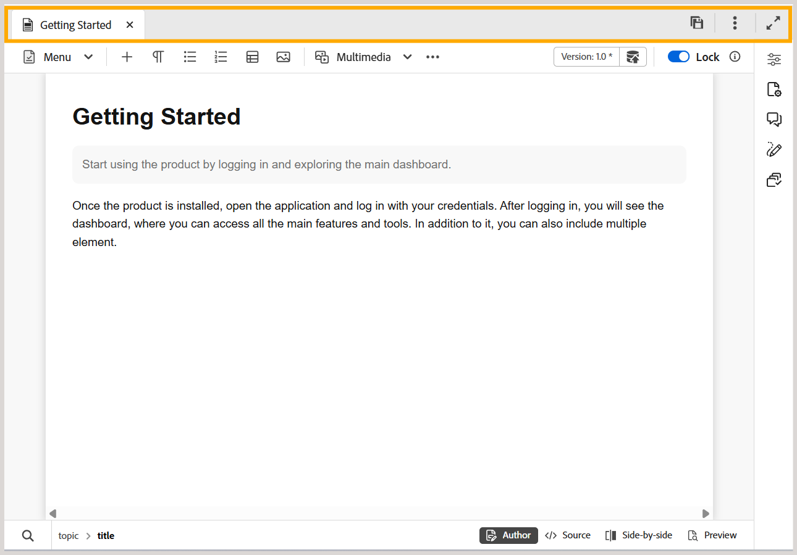

# Registerkartenleiste im Editor

>[!INFO]
>
> Dieses Thema gilt sowohl für den neuen als auch für den alten Editor. Während die Kernfunktionalität konsistent bleibt, werden Unterschiede in der Benutzeroberfläche, Terminologie und Interaktionen innerhalb des Inhalts ggf. durch Registerkarten und Hinweisen angezeigt.

Die Registerkartenleiste befindet sich oben in der Benutzeroberfläche des Editors und bietet Zugriff auf die verschiedenen Funktionen auf Dateiebene.

>[!BEGINTABS]

>[!TAB Neuer Editor]

>[!TAB Alter Editor]

>[!ENDTABS]

**Registerkarten**

Zeigt die aktuell geöffneten Themen im Editor als Datei-Registerkarten an. Sie können mehrere Themen gleichzeitig öffnen, die auf den jeweiligen Registerkarten in der Registerkartenleiste angezeigt werden. Standardmäßig können Sie die Dateititel auf den Registerkarten einsehen. Wenn Sie mit dem Mauszeiger auf eine Datei zeigen, können Sie den Dateititel und den Dateipfad als QuickInfo anzeigen.

>[!NOTE]
>
> Als Administrator können Sie auch festlegen, dass die Liste der Dateien nach Dateinamen auf den Registerkarten angezeigt wird. Wählen Sie die Option **Dateiname** im Abschnitt **Konfiguration der Editor-Dateien** Benutzereinstellungen[ aus](./intro-home-page.md#user-preferences).

Wenn Sie die Registerkarte Datei auswählen, wird ein Kontextmenü mit den Optionen Als neue Version speichern, Kopieren, Suchen in, Zu hinzufügen, Eigenschaften, Aufspaltung, Als PDF herunterladen und Schließen geöffnet.

**Alle speichern**

Speichert die von Ihnen vorgenommenen Änderungen in allen geöffneten Themen. Wenn mehrere Themen im Editor geöffnet sind, werden bei Auswahl von **Alle speichern** oder mithilfe der Tastenkombinationen **Strg**+**S** alle Dokumente mit einem Klick gespeichert. Sie müssen nicht jedes Dokument einzeln speichern.

>[!NOTE]
>
> Mit **Vorgang** Alle speichern“ wird keine neue Version der Themen erstellt. Um eine neue Version zu erstellen, verwenden Sie die Option **Als neue Version speichern**.

**KI-Assistent**

Ein leistungsstarkes, KI-gesteuertes Tool, das Ihre Produktivität durch intelligente Hilfe- und Authoring-Funktionen steigert. Es vereint zwei robuste KI-Funktionen - **Authoring** und **Help** - in der Experience Manager Guides-Oberfläche, sodass Sie Inhalte und Informationen aus der Experience Manager Guides-Dokumentation schneller und effizienter erstellen und aufrufen können.

>[!NOTE]
>
> Die Funktion KI-Assistent ist derzeit für Adobe Experience Manager Guides as a Cloud Service verfügbar.

**Ansicht erweitern**: Ermöglicht das Erweitern der Seitenansicht mithilfe des Symbols **Erweitern**. In dieser Ansicht ist die Kopfzeilenleiste mit dem Adobe Experience Manager-Logo ausgeblendet. Dadurch wird der Inhaltsbereich für die Bearbeitung maximiert. Um zur Standardansicht zurückzukehren, verwenden Sie das Symbol **Erweiterte Ansicht beenden**.

**Weitere Aktionen**: Bietet Zugriff auf zusätzliche Optionen. Durch Klicken auf diese Schaltfläche wird ein Menü mit den folgenden Optionen geöffnet:

- **Assets**: Leitet Sie je nach Einrichtung zu einem Ziel.
   - **Cloud Services**: Wenn Sie Cloud Services verwenden, gelangen Sie durch Auswahl der Option **Assets** zur Seite &quot;AEM-Navigation“.

   - **On-Premise-Software**: Wenn Sie Adobe Experience Manager Guides (4.2.1 und höher) verwenden, gelangen Sie durch Auswahl der Option **Assets** zu Ihrem aktuellen Dateipfad in der Assets-Benutzeroberfläche.
- **Workspace-Einstellungen**: Leitet Sie zum Dialogfeld &quot;Workspace-Einstellungen“. Weitere Informationen finden Sie unter [Konfigurieren von Workspace-](../cs-install-guide/workspace-settings.md).

>[!NOTE]
>
> Wenn Sie die Adobe Experience Manager Guides in einem On-Premise-Setup verwenden, wird die Option Workspace-Einstellungen weiterhin als **Einstellungen** im Menü Mehr Aktionen angezeigt.

- **Editor-Einstellungen**: Leitet Sie zum Dialogfeld Editor-Einstellungen, in dem Sie das Editor-Verhalten auf individueller Autorenebene anpassen können. Damit können Sie die Sichtbarkeit und das Verhalten von Tags, Kommentaren und anderen Einstellungen auf Editor-Ebene während des Authorings steuern. Weitere Informationen finden Sie unter [Editor-Einstellungen](./config-editor-settings.md).

**Übergeordnetes Thema:**[ Einführung in den Editor](web-editor.md)
