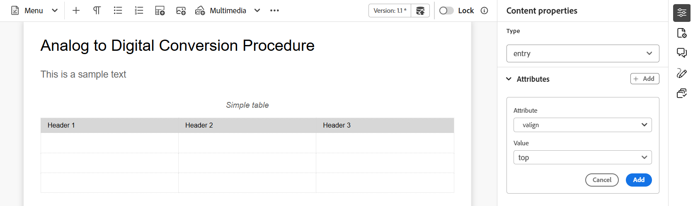

# Symbolleiste im Editor

Die Symbolleiste wird angezeigt, wenn Sie ein Thema oder eine Karte zur Bearbeitung im Editor öffnen. In der Symbolleiste stehen folgende Funktionen zur Verfügung:

- [Menü-Dropdown](#menu-dropdown)
- [Optionen zum Einfügen von Inhalten](#content-insertion-options)
- [Versionsinformationen und Schaltfläche Als neue Version speichern](#version-information-and-save-as-new-version)
- [Sperren/Entsperren](#lockunlock)

>[!NOTE]
>
> Die oben aufgeführten Funktionen gelten nur für Themendateien. Beim Arbeiten mit einer Zuordnungsdatei werden basierend auf der aktuellen Ansicht des Zuordnungs-Editors verschiedene Optionen in der Symbolleiste angezeigt. Weitere Informationen zu den Symbolleistenoptionen des Zuordnungs-Editors [ Sie im Dokument ](./map-editor-advanced-map-editor.md)Funktionen des Zuordnungs-Editors“.

## Menü-Dropdown

Die Dropdown-Liste Menü bietet Zugriff auf die Funktionen zum Bearbeiten, Suchen und Ersetzen, Versionsverlauf, Versionsbezeichnung, Zusammenführen, Prüfungsaufgabe erstellen, Änderungen verfolgen und Tags .

Diese Funktionen werden im Einzelnen wie folgt erläutert:

**Aktionen bearbeiten**

Greifen Sie beim Bearbeiten eines Themas im Editor auf die verschiedenen Bearbeitungsaktionen zu, z. B. **Ausschneiden** oder ***Strg***+***X*** , **Kopieren** oder ***Strg***+***C*** , **Rückgängig** oder ***Strg***+Z ***,**&#x200B;Wiederholen&#x200B;**oder*** CtrlCtrlY **&#x200B;**&#x200B;**&#x200B; **&#x200B;**&#x200B;** **&#x200B;**&#x200B;Löschenim Dropdown-Menü.

**Suchen und Ersetzen**

Die Funktion **Suchen und Ersetzen** ist im Autoren- und Source-Ansichtsmodus verfügbar. Wenn diese Option aktiviert ist, wird die Textleiste Suchen und Ersetzen unten im Themenbearbeitungsbereich angezeigt. Sie können die Tastaturbefehle (**+**+**F) verwenden** um die Leiste zum Suchen und Ersetzen aufzurufen.

{align="left"}

Über das Einstellungssymbol \(\) können Sie die Suchoptionen **Groß-/Kleinschreibung ignorieren** und **Nur ganzes Wort** umschalten. Um die Suche ohne Berücksichtigung der Groß-/Kleinschreibung durchzuführen, aktivieren Sie die Option \(oder wählen Sie\) **Groß-/Kleinschreibung ignorieren**. Andernfalls müssen Sie, wenn Sie die Suche unter Berücksichtigung der Groß-/Kleinschreibung durchführen möchten, die Option \(oder deselect\) **Groß-/Kleinschreibung ignorieren** deaktivieren. Sie können auch ein ganzes Wort suchen.

Die Suche erfolgt sofort, d. h. wenn Sie den Suchbegriff oder das Wort in das Feld **Suchen** eingeben, wird der Begriff sofort durchsucht und im Thema ausgewählt. Um einen Text in Ihrem Thema zu ersetzen, geben Sie den Suchbegriff und seine Ersetzung in die entsprechenden Felder ein und wählen Sie die Schaltfläche **Ersetzen** oder **Alle ersetzen** aus.

In der Source-Ansicht **die Funktion „Suchen und Ersetzen** äußerst nützlich für die Suche nach einem bestimmten Element oder Attribut. Wenn Sie beispielsweise den Wert des `@product`-Attributs ersetzen möchten, kann dies einfach über die Source-Ansicht erfolgen. In der Autorenansicht können Sie nicht anhand eines Attributs oder Elements suchen. Bei Verwendung der Funktion „Alle ersetzen **müssen Sie jedoch mit Vorsicht vorgehen** da dadurch der XML-Code überschrieben werden könnte.

**Versionsverlauf**

Mit **Funktion „Versionsverlauf** im Editor können Sie die verfügbaren Versionen Ihrer DITA-Dateien überprüfen, vergleichen und auf eine beliebige Version aus dem Editor selbst zurücksetzen. Sie können den Inhalt und die Metadaten der aktuellen Version (die auch eine Arbeitskopie sein kann) mit einer beliebigen früheren Version derselben Datei vergleichen. Sie können auch die Beschriftungen und Kommentare für die verglichenen Versionen anzeigen.

>[!NOTE]
>
> Die Optionen für den Versionsverlauf werden nur angezeigt, wenn Änderungen an der ersten Version des Themas oder der Zuordnung vorgenommen wurden.

    
 Schritte zum Zugriff auf den Versionsverlauf 

1. Öffnen Sie ein Thema im Editor.
1. Wählen Sie **Versionsverlauf** aus der Dropdown-Liste **Menü** aus.

   Das **Versionsverlauf** wird angezeigt.

   {width="550" align="left"}

   *Vorschau der Änderungen in den verschiedenen Versionen eines Themas.*

1. Wählen Sie in der Dropdown-Liste „Vergleichen mit“ eine Version des Themas aus **mit dem Sie vergleichen oder** möchten.

   >[!NOTE]
   >
   > Wenn einer Version Beschriftungen zugewiesen sind, werden diese ebenfalls \(in Klammern\) zusammen mit der Versionsnummer angezeigt.

1. Aktivieren Sie die **Beschriftungen und Kommentare anzeigen**, um die Beschriftungen und Kommentare anzuzeigen, die auf die aktuelle und die verglichene Version angewendet wurden.
1. Sie können die folgenden Informationen auch im Dialogfeld **Versionsverlauf** anzeigen:

   **Vorschau**-Registerkarte: Der neu hinzugefügte Inhalt ist in grüner Schriftart, und der gelöschte Inhalt ist in roter Schriftart.

   Registerkarte **Metadaten**: Die neu hinzugefügten Metadaten sind in grüner Schrift, die gelöschten Metadaten in roter Schrift.

   {width="550" align="left"}

   *Vergleichen der Metadaten verschiedener Versionen im Versionsverlauf.*

   >[!NOTE]
   >
   > Ihr Systemadministrator kann die Metadaten, die angezeigt werden sollen, über die Registerkarte Metadaten unter &quot;**&quot;**. Weitere Informationen finden Sie im Abschnitt **Weitere Aktionen** der [Registerkartenleiste](./web-editor-tab-bar.md).

   Sie können auch die Benutzer- und Zeitdetails der aktuellen und der verglichenen Version anzeigen.

   Nachdem Sie eine Version aus der Dropdown-Liste ausgewählt haben, wird **Option „Auf ausgewählte Version**&quot; verfügbar gemacht. Im Vorschaufenster werden die Unterschiede zwischen der aktuellen Version und der ausgewählten Version des Themas angezeigt.

1. Wählen Sie **Auf ausgewählte Version zurücksetzen** aus, um Ihre Arbeitskopie mit der ausgewählten Version des Themas wiederherzustellen.

   Das Dialogfeld Version zurücksetzen wird angezeigt.

   {width="550" align="left"}

1. \(*Optional*\) Geben Sie einen Grund für die Rückkehr zu einer früheren Version an. Sie können auch eine neue Version der derzeit aktiven Arbeitskopie Ihres Themas erstellen.

1. Wählen Sie **Bestätigen** aus.

   Ihre Arbeitskopie der Datei wird auf die ausgewählte Version zurückgesetzt. Wenn Sie eine neue Version der derzeit aktiven Arbeitskopie erstellen, wird auch eine neue Version der Datei mit allen Arbeitsänderungen erstellt.

   Wenn Sie zu einer früheren Version zurückkehren, wird ein visueller Hinweis angezeigt, der angibt, dass die Version, an der Sie gerade arbeiten, nicht die neueste Version ist.

   {align="left"}

**Versionsbezeichnungen**

Beschriftungen helfen Ihnen bei der Identifizierung des Stadiums, in dem sich ein bestimmtes Thema im DDLC befindet (Document Development Life Cycle). Wenn Sie beispielsweise an einem Thema arbeiten, können Sie die Bezeichnung als „Genehmigt“ festlegen. Sobald ein Thema veröffentlicht und Kunden zur Verfügung gestellt wurde, können Sie diesem Thema die Bezeichnung „Freigegeben“ zuweisen.

Mit Experience Manager Guides können Sie Beschriftungen in einem Freiformtextformat angeben oder einen Satz vordefinierter Beschriftungen verwenden. Mit der benutzerdefinierten Beschriftung können alle Autorinnen und Autoren im System eine Beschriftung gemäß ihrer Auswahl angeben. Dies bietet Flexibilität, führt jedoch zu inkonsistenten Beschriftungen im System. Um dieses Problem zu beheben, können Admins einen Satz vordefinierter Kennzeichnungen konfigurieren. Weitere Informationen zum Konfigurieren vordefinierter Kennzeichnungen finden Sie unter *Konfigurieren und Anpassen des XML-Web* Editors in der Adobe Experience Manager Guides as a Cloud Service installieren und konfigurieren.

Diese Beschriftungen werden Autoren in Form einer Dropdown-Liste angezeigt, wenn sie eine Beschriftung angeben müssen. Dadurch wird sichergestellt, dass im System nur vordefinierte, konsistente Kennzeichnungen verwendet werden.

Es gibt verschiedene Methoden, mit denen Sie Beschriftungen auf Ihre Themen anwenden können - [Versionsverlauf](web-editor-use-label.md) Bedienfeld in der Assets-Benutzeroberfläche, [Baselines](/help/product-guide/user-guide/generate-output-use-baseline-for-publishing.md)-Benutzeroberfläche und im Editor. Mit der Funktion „Versionsbezeichnung“ im Editor können Autoren ihren Themen schnell und einfach Beschriftungen zuweisen.

    
 Schritte zum Hinzufügen von Beschriftungen zu Ihrem Thema über den Editor 

1. Öffnen Sie ein Thema im Editor.

1. Wählen Sie **Versionsbezeichnungen** aus dem Dropdown-Menü aus.

   Das Dialogfeld Versionsbeschriftungs-Verwaltung wird angezeigt.

   {width="350" align="left"}

   Das Dialogfeld Versionsbeschriftungsverwaltung ist in zwei Teile unterteilt: Das linke Bedienfeld enthält eine Liste der für das Thema verfügbaren Versionen zusammen mit der Dropdown-Liste Beschriftung \(oder einem Textfeld zur Eingabe einer Beschriftung\) und das rechte Bedienfeld mit einer Vorschau des Themas.

1. Wählen Sie eine Version aus, auf die Sie Kennzeichnungen anwenden möchten.

   Wenn Sie in der Versionsliste eine andere Version des Themas auswählen, werden im Vorschaubereich die Änderungen zwischen der aktuellen Version und der ausgewählten Version des Themas angezeigt

   >[!NOTE]
   >
   > Wenn eine Beschriftung bereits auf eine Version angewendet wird, wird sie neben der Versionsnummer in der Dropdown-Liste und unter der Liste Version auswählen angezeigt. Sie können eine vorhandene Beschriftung entfernen, indem Sie das Symbol \(**x**\) neben der Beschriftung auswählen.

1. Wenn Ihr Administrator eine Liste von Kennzeichnungen definiert hat, wird eine Dropdown-Liste der Kennzeichnungen angezeigt, aus der Sie die Kennzeichnungen auswählen können, die Sie anwenden möchten. Sie können mehrere Bezeichnungen aus der Dropdown-Liste auswählen.

   Andernfalls wird ein Textfeld angezeigt, in das Sie die Beschriftungen eingeben können, die Sie zu Ihrem Thema hinzufügen möchten.

   >[!NOTE]
   >
   > Eine Bezeichnung kann nicht auf mehrere Versionen eines Themas angewendet werden. Wenn Sie versuchen, eine vorhandene Beschriftung zu verknüpfen, erhalten Sie die Möglichkeit, sie aus der vorhandenen Version zu entfernen und auf die ausgewählte Version des Themas anzuwenden.

1. Wählen Sie **Bezeichnung hinzufügen** aus.

1. Wählen Sie in der Bestätigungsmeldung Kennzeichnung anwenden die Option **Kennzeichnung verschieben (falls in einer anderen Version verwendet)**, um Kennzeichnungen von einer vorhandenen Version in die ausgewählte Version zu verschieben. Wenn Sie diese Option nicht auswählen und es Beschriftungen gibt, die einer anderen Version des Themas zugewiesen sind, werden diese nicht in die Version des ausgewählten Themas verschoben. Solche Kennzeichnungen werden beim Bezeichnungsantrag ignoriert.

**Zusammenführen**

Wenn Sie in einer Umgebung mit mehreren Autoren arbeiten, wird es schwierig zu verfolgen, welche Änderungen die anderen Autoren in einem Thema oder einer Zuordnung vorgenommen haben. Mit der Zusammenführungsfunktion haben Sie nicht nur mehr Kontrolle über die Anzeige der Änderungen, sondern auch darüber, welche Änderungen in der neuesten Version des Dokuments beibehalten werden.

    
 Zusammenführen von Themendateien 

Um Änderungen in einem Thema zusammenzuführen, führen Sie die folgenden Schritte aus:

1. Öffnen Sie ein Thema im Editor.

1. Wählen Sie **Zusammenführen** aus.

   Das Dialogfeld „Zusammenführen“ wird angezeigt.

   {width="550" align="left"}

1. *\(Optional\)* Sie können auch eine neue Datei an einem anderen Speicherort im Repository suchen und auswählen.

1. Wählen Sie eine Version der Datei aus, mit der Sie die aktuelle Version der Datei vergleichen möchten.

1. Wählen Sie unter Optionen Folgendes aus:

   - **Änderungen aus ausgewählter Version verfolgen**: Diese Option zeigt alle Inhaltsaktualisierungen in Form von verfolgten Änderungen an. Sie können dann Änderungen im Dokument einzeln oder in einem Schritt akzeptieren oder ablehnen.

   - **Auf ausgewählte Version zurücksetzen**: Mit dieser Option wird die aktuelle Version des Dokuments auf die ausgewählte Version zurückgesetzt. Mit dieser Option haben Sie keine Kontrolle darüber, welche Inhalte akzeptiert oder abgelehnt werden.

1. Wählen Sie **Fertig**.

1. Wenn Sie die Option **Änderungen aus ausgewählter Version nachverfolgen** ausgewählt haben, werden alle Änderungen aus der ausgewählten Version in der Funktion „Nachverfolgte Änderungen“ im rechten Bedienfeld angezeigt.

   Sie können alle Kommentare im Bedienfeld „Getrackte Änderungen“ akzeptieren oder ablehnen oder einzelne Kommentare akzeptieren oder ablehnen.

    
 Zusammenführen von Zuordnungsdateien 

Um Änderungen in einer Zuordnungsdatei zusammenzuführen, führen Sie die folgenden Schritte aus:

1. Öffnen Sie eine Karte im Editor.

1. Wählen Sie **Zusammenführen** aus.

   Das Dialogfeld „Zusammenführen“ wird angezeigt.

   {width="550" align="left"}

1. *\(Optional\)* Sie können auch eine neue Datei an einem anderen Speicherort im Repository suchen und auswählen.

1. Wählen Sie eine Version der Datei aus, mit der Sie die aktuelle Version der Datei vergleichen möchten.

1. Wählen Sie unter Optionen Folgendes aus:

   - **Änderungen aus ausgewählter Version verfolgen**: Mit dieser Option werden alle Inhaltsaktualisierungen in Form von Änderungen nachverfolgt. Sie können dann Änderungen im Dokument einzeln oder in einem Schritt akzeptieren oder ablehnen.

   - **Auf ausgewählte Version zurücksetzen**: Mit dieser Option wird die aktuelle Version des Dokuments auf die ausgewählte Version zurückgesetzt. Mit dieser Option haben Sie keine Kontrolle darüber, welche Inhalte akzeptiert oder abgelehnt werden.

1. Wählen Sie **Fertig**.

1. Wenn Sie die Option **Änderungen aus ausgewählter Version nachverfolgen** ausgewählt haben, werden alle Änderungen aus der ausgewählten Version im Bedienfeld „Nachverfolgte Änderungen“ angezeigt (rechts).

   Sie können alle Änderungen im Bedienfeld „Nachverfolgte Änderungen“ annehmen oder ablehnen oder einzelne Änderungen in der Zuordnungsdatei akzeptieren oder ablehnen.

**Prüfungsaufgabe erstellen**

Sie können [eine Prüfungsaufgabe erstellen](./review-send-topics-for-review.md) des aktuellen Themas oder der Zuordnungsdatei direkt im Editor erstellen. Öffnen Sie die Datei, für die Sie die Prüfungsaufgabe erstellen möchten, und wählen Sie **Prüfungsaufgabe erstellen** aus dem Dropdown-Menü aus, um den Prozess zur Erstellung der Überprüfung zu starten.

**Änderungen verfolgen**

Sie können alle an einem Dokument vorgenommenen Aktualisierungen nachverfolgen, indem Sie den Modus Änderungen nachverfolgen aktivieren. Nach der Aktivierung der Tracking-Änderungen werden alle Einfügungen und Löschungen im Dokument erfasst. Der gesamte gelöschte Inhalt wird mithilfe von Durchgestrichen hervorgehoben, und alle Einfügungen werden in grünem Text hervorgehoben. Darüber hinaus werden die Änderungsleisten am Rand der Themenseite angezeigt. Auch hier wird ein roter Balken für gelöschte Inhalte und ein grüner Balken für hinzugefügte Inhalte angezeigt. Wenn sich eine Ergänzung und ein Löschvorgang in derselben Zeile befinden, werden sowohl grüne als auch rote Balken angezeigt.

Der folgende Screenshot zeigt den gelöschten und eingefügten Inhalt zusammen mit den Änderungsleisten:

{width="650" align="left"}

Ein typischer Anwendungsfall für das Tracking von Änderungen in einem Dokument kann die Durchführung einer Peer Review sein. Sie können Änderungen nachverfolgen und Ihr Dokument zur Überprüfung freigeben. Die Überprüfenden nehmen dann Änderungen vor, wenn die Nachverfolgung aktiviert ist. Wenn Sie das Dokument erhalten, sollten Sie über einen Mechanismus verfügen, mit dem Sie die vorgeschlagenen Aktualisierungen anzeigen können und bequem Änderungen akzeptieren oder ablehnen können.

Experience Manager Guides stellt die Funktion „Getrackte Änderungen“ bereit, die Informationen zu den im Dokument vorgenommenen Aktualisierungen enthält. Die Funktion „Nachverfolgte Änderungen“ enthält Informationen dazu, welche Aktualisierungen vorgenommen wurden, wer sie vorgenommen hat und zu welchem Zeitpunkt. Mit der Funktion „Nachverfolgte Änderungen“ können Sie die vorgeschlagenen Aktualisierungen im Dokument auch einfach akzeptieren oder ablehnen.

Um auf die Funktion zuzugreifen, wählen **im rechten Bedienfeld das Symbol**&#x200B;Änderungen verfolgen“ aus.

{width="300" align="left"}

Durch Auswählen einer verfolgten Änderung wird der geänderte Inhalt im Dokument ausgewählt. Sie können eine Änderung annehmen, indem Sie auf das Symbol Änderung akzeptieren klicken, oder sie ablehnen, indem Sie die Änderung ablehnen auswählen.

Wenn Sie alle Änderungen mit einem Klick akzeptieren oder ablehnen möchten, wählen Sie **Alle Änderungen akzeptieren** oder **Alle Änderungen ablehnen**.

>[!NOTE]
>
> Im Vorschaumodus können Sie das Dokument mit oder ohne Markierungen des geänderten Inhalts anzeigen. Weitere Informationen finden Sie im [Vorschau](web-editor-views.md#preview-mode)-Modus.

**Tags**

Die **Tags**-Funktion im Editor ist eine Umschalter-Schaltfläche, die die Sichtbarkeit von DITA-Elementen steuert. Wenn diese Option aktiviert ist, werden strukturelle Tags im Inhalt angezeigt, sodass Sie die zugrunde liegenden DITA-Elemente effektiver anzeigen und verwalten können. Wenn diese Option deaktiviert ist, blendet der Editor diese Tags aus und bietet so eine sauberere und fokussiertere Authoring-Umgebung.

Der folgende Screenshot zeigt ein Dokument mit aktivierter Tag-Ansicht:

{width="650" align="left"}

Die folgenden Vorgänge können in einem Dokument mit Tags ausgeführt werden:

- **Element auswählen**: Wählen Sie das öffnende oder schließende Tag eines Elements aus, um seinen Inhalt auszuwählen.

- **Tags erweitern oder reduzieren**: Wählen Sie das + oder - Anmelden eines Tags aus, um es zu erweitern oder zu reduzieren.

- **Kontextmenü verwenden**: Das Kontextmenü bietet Optionen zum Ausschneiden, Kopieren oder Einfügen des ausgewählten Elements. Sie können ein Element auch vor oder nach dem ausgewählten Element einfügen. Die anderen Optionen ermöglichen es Ihnen, für das ausgewählte Element eine ID zu generieren oder den Bereich „Eigenschaften“ zu öffnen.

- **Elemente per Drag-and-Drop verschieben**: Wählen Sie das Tag eines Elements aus und ziehen Sie es einfach per Drag-and-Drop in Ihr Dokument. Wenn der Ablageort ein gültiger Ort ist, an dem das Element zulässig ist, wird das Element an dem abgelegten Ort platziert.

>[!NOTE]
>
> Wenn ein(e) Benutzende(r) die Tag-Ansicht im Editor aktiviert, bleibt sie auch sitzungsübergreifend aktiviert. Das bedeutet, dass Sie die Tag-Ansicht nicht erneut aktivieren müssen, um später darauf zuzugreifen. Der Standardwert für die Tags-Ansicht für die Sitzung eines neuen Benutzers wird durch die `tagsView`-Eigenschaft in der `ui\_config.json` bestimmt. Weitere Informationen finden Sie im Abschnitt [Standardwert für die Tag-Ansicht konfigurieren](../cs-install-guide/configure-default-value-tags-view.md) unter Installieren und Konfigurieren von Adobe Experience Manager Guides as a Cloud Service.

## Optionen zum Einfügen von Inhalten

**Element** - 

Fügt ein gültiges Element an der aktuellen oder nächsten gültigen Position ein. Sie können auch den Tastaturbefehl ***Alt***+***Eingabetaste*** verwenden, um das Dialogfeld Element zu öffnen. Wenn Sie beispielsweise einen Absatz bearbeiten, wird im Dialogfeld **Element** eine Liste von Elementen angezeigt, die in den Absatz eingefügt werden können. Wählen Sie das Element aus, das Sie einfügen möchten. Sie können die Tastatur verwenden, um durch die Liste der Elemente zu scrollen und die Eingabetaste ***,*** das gewünschte Element einzufügen.

Sie können zwei Arten gültiger Elemente anzeigen:

- **Gültige Elemente am aktuellen Speicherort**: Die Liste zeigt die Elemente an, die Sie am aktuellen Cursor-Speicherort selbst einfügen können.

- **Gültige Elemente außerhalb des aktuellen Speicherorts**: Die Liste zeigt die Elemente an, die Sie für das aktuelle Element innerhalb der Elementhierarchie nach einem der übergeordneten Elemente einfügen können.

Wenn Sie sich beispielsweise im Inline-`<b>` befinden, können Sie Elemente wie `<u>`, `<xref>` `<i>` an der aktuellen Position einfügen. Im Gegensatz dazu können Sie Elemente wie `<table>` und `<topic>` außerhalb des aktuellen Speicherorts einfügen.

Sie können auch ein Zeichen oder eine Zeichenfolge in das Suchfeld eingeben und nach den Elementen suchen, die damit beginnen.

{width="300" align="left"}

*Geben Sie &#39;t&#39; ein, um nach allen gültigen Elementen zu suchen, die mit &#39;t&#39; beginnen.*

Wenn Sie wie ein `note` in einem Blockelement arbeiten, verwenden Sie das Symbol Element einfügen , um ein neues Element nach dem `note` Element einzufügen. Im folgenden Screenshot wurde ein Element NOTE in das Element p \(Absatz\) eingefügt:

{align="left"}

Wenn Sie im Notizelement die Eingabetaste drücken, wird ein neuer Absatz innerhalb des Notizelements selbst erstellt. Um ein neues Element außerhalb der Anmerkung einzufügen, wählen Sie das p-Element \(im Screenshot hervorgehoben\) im Breadcrumb für Elemente aus und wählen Sie dann das Symbol Element aus oder drücken Sie ***Alt***+***Eingabetaste***, um das Dialogfeld Element einfügen zu öffnen. Wählen Sie anschließend das gewünschte Element aus und drücken Sie die Eingabetaste, um das ausgewählte Element nach dem Element Notiz einzufügen.

Sie können auch ein -Element zwischen zwei -Elementen hinzufügen, wenn ein blinkender Blockcursor angezeigt wird.

{width="300" align="left"}

Wenn Sie beispielsweise an einem DITA-Thema arbeiten und der Blockcursor zwischen der Kurzbeschreibung und dem Textkörper blinkt, können Sie `prolog` Element hinzufügen und dann Copyright, Autor und andere Details hinzufügen.

Eine andere Möglichkeit, ein neues Element einzugeben, ist die Verwendung des Kontextmenüs. Klicken Sie mit der rechten Maustaste auf eine beliebige Stelle in Ihrem Dokument, um das Kontextmenü aufzurufen. Wählen Sie in diesem Menü **Element einfügen**, um das Dialogfeld **Element einfügen** anzuzeigen, und wählen Sie das Element aus, das Sie einfügen möchten.

{width="300" align="left"}

**Absatz** - 

Fügen Sie das Absatzelement an der aktuellen oder nächsten gültigen Position ein.

**Aufzählungsliste** - 

Erstellt eine Liste mit Aufzählungszeichen am aktuellen oder nächsten gültigen Speicherort. Wenn Sie sich auf einer Aufzählungsliste befinden und dieses Symbol auswählen, wird das Element in einen normalen Absatz konvertiert.

**Nummerierte Liste** - 

Erstellt eine nummerierte Liste am aktuellen oder nächsten gültigen Speicherort. Wenn Sie sich auf einer nummerierten Liste befinden und dieses Symbol auswählen, wird das Element in einen normalen Absatz konvertiert.

>[!NOTE]
>
>Sie können auch die Option **Liste teilen** aus dem Kontextmenü eines Listenelements auswählen, um die aktuelle Liste zu teilen und eine neue Liste auf derselben Ebene zu beginnen.

**Tabelle** - 

Fügt eine Tabelle am aktuellen oder nächsten gültigen Speicherort ein. Wählen Sie das Symbol Tabelle aus, um das Dialogfeld Einfache Tabelle einfügen zu öffnen.

{width="550" align="left"}

>[!NOTE]
>
> Sie können auch eine Tabelle aus MS Word oder Excel kopieren und in die Experience Manager Guides-Themendatei einfügen. Die kopierte Tabelle wird je nach den in der XML-Editor-Konfiguration konfigurierten Einstellungen entweder als `<simpletable>` oder `<tgroup>` eingefügt. Weitere Informationen finden Sie unter [Konfigurieren der Anzeige eingefügter Tabellen](../cs-install-guide/conf-pasted-tables.md).

Sie können die Anzahl der Zeilen und Spalten angeben, die in der Tabelle erforderlich sind. Wenn Sie die erste Zeile als Tabellenüberschrift beibehalten möchten, wählen Sie die Option **Erste Zeile als Überschrift festlegen** aus. Um der Tabelle einen Titel hinzuzufügen, geben Sie ihn im Feld Titel ein.

Nachdem eine Tabelle eingefügt wurde, können Sie die Tabelle mit dem Kontextmenü ändern.

{width="550" align="left"}

Über das Kontextmenü der Tabelle haben Sie folgende Möglichkeiten:

- Zellen, Zeilen oder Spalten einfügen

- Zusammenführen von Zellen in Rechts- und Abwärtsrichtung

- Zellen horizontal oder vertikal teilen

- Zellen, Zeilen oder Spalten löschen

- IDs generieren

    
 Attribute für mehrere Zellen, die gesamte Zeile oder Spalte einer Tabelle definieren 

Sie können auch Attribute für mehrere Zellen, die gesamte Zeile oder Spalte einer Tabelle definieren. Um beispielsweise eine Tabellenzelle auszurichten, ziehen Sie die gewünschte Zelle und wählen Sie sie aus. Im Bedienfeld Inhaltseigenschaften (rechts) ändert sich die Eigenschaft **Typ** in **Eintrag**.

1. Wählen **Abschnitt „Attribute** die Option **+Hinzufügen**.
1. Wählen Sie das `@valign` Attribut aus der Dropdown **Liste „Attribut** aus.
1. Wählen Sie aus der Dropdown-Liste Wert die gewünschte Textausrichtung aus, die Sie auf die ausgewählten Tabellenzellen anwenden möchten.
1. Wählen Sie **Hinzufügen.**

{align="left"}

**Bild** - 

Fügt ein Bild am aktuellen oder nächsten gültigen Speicherort ein. Klicken Sie auf das Bildsymbol, um das Dialogfeld Bild einfügen zu öffnen. Suchen Sie dann das Bild, das Sie einfügen möchten, und wählen Sie es aus.

>[!NOTE]
>
> Sie können auch ein Bild hinzufügen, indem Sie es aus Ihrem lokalen System auf Ihren Artikel ziehen und ablegen. In diesem Fall wird die Bilddatei mithilfe des Workflows **Assets hochladen** hinzugefügt.  Weitere Informationen finden Sie im Abschnitt **Workflow &quot;Assets hochladen** im [ Bereich](./web-editor-left-panel.md).

{width="300" align="left"}

Sie können einen Bild-/Figurtitel und alternativen Text für das Bild im Dialogfeld Bild einfügen hinzufügen.

>[!NOTE]
>
> Wenn Sie ein Bild einfügen und einen alternativen Text für dasselbe angeben, wird es innerhalb des `<alt>` gemäß den neuesten DITA-Standards hinzugefügt. Die Verwendung des Attributs `@alt` für alternativen Text ist veraltet, wird aber in früheren DITA-Versionen weiterhin unterstützt.

Mit der Option **Datei auswählen** können Sie nach der gewünschten Bilddatei anhand des Dateinamens suchen. Sie können die Suchergebnisse auch nach Pfad \(zum Suchen in\), Sammlungen, Dateityp und Tags filtern. Nachdem Sie die gewünschte Bilddatei gefunden haben, wählen Sie die Datei aus und klicken Sie auf **Auswählen**, um das Bild in Ihr Dokument einzufügen. Sie können verschiedene Formate von Bilddateien einfügen, z. B. `.png`, `.svg`, `.gif`, `.jpg`, `.eps`, `.ai`, `.psd` und mehr.

Nachdem Sie ein Bild eingefügt haben, können Sie die Attribute für Höhe, Breite, Platzierung und Inhalt im Bedienfeld Inhaltseigenschaften ändern. Wählen Sie die Bilddatei aus und nehmen Sie dann Änderungen im Bedienfeld Inhaltseigenschaften im rechten Bedienfeld vor.

{align="left"}

Das Feld Source zeigt die UUID der eingefügten Bilddatei an. Sie können den vollständigen Pfad der eingefügten Bilddatei finden, indem Sie den Mauszeiger über das Source-Feld bewegen. Der Pfad wird in der QuickInfo angezeigt.

Sie können die Größe eines Bildes ändern, indem Sie entweder den Wert für Höhe oder Breite für die Bilddatei angeben. Das Seitenverhältnis des Bildes wird automatisch beibehalten. Sie können auch das Seitenverhältnis der Bilddatei nicht beibehalten, indem Sie das Schlosssymbol \(von Seitenverhältnis beibehalten\) auswählen und die Werte für Höhe und Breite angeben.

Sie können die Platzierungseinstellung für das Bild auch als Inline- oder Break-Einstellung festlegen. Wenn Sie die Option Platzierung aufheben verwenden, können Sie anschließend auswählen, wo das Bild ausgerichtet werden soll (links, zentriert oder rechts).

Sie können auch andere Eigenschaften für eine Bilddatei hinzufügen, indem Sie die erforderlichen Eigenschaften im Feld **Attribute** auswählen.

>[!NOTE]
>
>Sie können auch anklickbare Bereiche \(Imagemap\) in Ihrem Bild definieren. Weitere Informationen finden Sie in der Beschreibung **Bildzuordnung einfügen/bearbeiten** im Abschnitt [Linkes Bedienfeld](web-editor-features.md#left-panel).

**Kontextmenü für Bild- oder Mediendateien**

Sie können auch einige allgemeine Vorgänge für Bilder und Mediendateien über das Kontextmenü durchführen. Klicken Sie mit der rechten Maustaste auf eine beliebige Stelle auf Ihrem Bild, um das Kontextmenü aufzurufen.

Das Kontextmenü bietet Optionen zum Ausschneiden, Kopieren oder Einfügen des Bildes oder Mediums. Sie können ein Element vor oder nach dem ausgewählten Element einfügen. Sie haben auch die Möglichkeit, ein Element umzubenennen oder seinen Wrapper zu entfernen. Sie können das ausgewählte Bild oder die ausgewählten Medien im Repository finden oder die Vorschau der Datei in der Assets-Benutzeroberfläche anzeigen.

Die anderen Optionen im Kontextmenü ermöglichen es Ihnen, einen Pfad zu kopieren, eine Imagemap zu bearbeiten, ein Element umzubenennen, einen Ausschnitt zu erstellen oder IDs für das ausgewählte Element zu generieren.

**Imagemap einfügen/bearbeiten**

Fügt eine Imagemap in das ausgewählte Bild ein. Ein Bild mit klickbaren Bereichen, die auf Themen oder Web-Seiten verlinken, wird als Imagemap bezeichnet.

Wählen Sie ein Bild im aktuellen Thema aus und klicken Sie auf das Symbol Imagemap einfügen/bearbeiten , um das Dialogfeld Imagemap einfügen zu öffnen.

{width="650" align="left"}

Wählen Sie die bevorzugte Form aus ,  oder Polygon-, um einen Bereich über einem Bild zu definieren, den Sie als Link verwenden möchten. Nach der Definition eines Bereichs wird das Dialogfeld Referenz angezeigt, in dem Sie den Link zu internen oder externen Inhalten angeben müssen:

{width="650" align="left"}

Wenn sich Bereiche überschneiden, können Sie die Form nach vorne bringen oder durch Klicken auf das entsprechende Symbol in der Symbolleiste nach hinten senden. Sie können einen Bereich auch entfernen, indem Sie ihn auswählen und auf das Symbol Löschen klicken. Durch Doppelklicken auf einen Bereich wird das Dialogfeld Referenz geöffnet, in dem Sie den Ziel-Link ändern können. Nachdem Sie die erforderlichen Bereiche auf dem Bild markiert haben, speichern Sie die Änderungen, indem Sie **Fertig** auswählen.

**Multimedia**

Fügt verschiedene Arten von Multimediadateien ein. Wählen Sie das Symbol Multimedia-Dropdown und dann den Dateityp aus, den Sie einfügen möchten. Folgende Multimediaformate werden unterstützt:

- Audiodatei
- Videodatei
- YouTube
- Vimeo

Bei Auswahl der Option Audio- oder Videodatei wird die Repository-Ansicht angezeigt, in der Sie die gewünschte Datei suchen und auswählen können. Wenn Sie YouTube oder Vimeo wählen, erhalten Sie den Dialog Multimedia einfügen. Fügen Sie den Link der Videodatei in das Feld Weblink ein und wählen Sie Einfügen aus, um das Video an der aktuellen oder nächsten gültigen Position in Ihrem Dokument hinzuzufügen.

>[!NOTE]
>
> Beim Hinzufügen eines YouTube-Video-Links müssen Sie die Zeichenfolge `watch?v=` durch `embed` in der URL ersetzen. Um beispielsweise einen YouTube-Video-Link hinzuzufügen: `https://www.youtube.com/**watch?v**=WlIKQOrmZcs`, müssen Sie ihn wie folgt hinzufügen: `https://www.youtube.com/**embed/**WlIKQOrmZcs`. Durch diese Änderung wird sichergestellt, dass das Video in die AEM-Site und die PDF-Ausgabe eingebettet wird.

Sie können die Audio- oder Videodatei auch über das Dialogfeld „Multimedia einfügen“ hinzufügen. Wählen Sie die Option Audio-/Videodatei und dann das Symbol „Durchsuchen“ aus, um die Repository-Ansicht zu starten. Wählen Sie die Audio- oder Videodatei aus dem Repository aus und klicken Sie auf **Auswählen**, um den Link der Datei in das Feld Audio-/Videodatei einzufügen. Wenn Sie eine Videodatei auswählen, wird auch eine Vorschau der Datei im Bereich Vorschau angezeigt. Sie können die Videodatei abspielen, um ihre Vorschau anzuzeigen.

{width="650" align="left"}

**Querverweis**

Fügen Sie Verweise vom Typ ein - Inhaltsreferenz, Inhaltsschlüsselreferenz, Schlüsselreferenz, Dateireferenz, Weblink oder E-Mail-Link.

Wählen Sie das Symbol **Datei auswählen** \(für Inhaltsreferenz und Dateireferenz\) oder **Stammzuordnungssymbol auswählen** \(für Inhaltsschlüsselreferenz und Schlüsselreferenz\) aus und wählen Sie die gewünschte Datei oder den gewünschten Inhalt aus, zu der bzw. dem eine Verknüpfung hergestellt werden soll.

{width="650" align="left"}

Dem Dokument wird ein Link der ausgewählten Referenz hinzugefügt. Das Kontextmenü für den Link bietet die folgenden Optionen:

- **Element einfügen**: Zeigt eine Liste gültiger Elemente an, die Sie im jeweiligen Kontext einfügen können.
- **UUID kopieren**: Kopiert die UUID der eingefügten Referenz.
- **Pfad kopieren**: Kopiert den vollständigen Pfad der eingefügten Referenz.
- **IDs generieren**: Generiert eine eindeutige ID für den eingefügten Verweis.

Sie können auch anhand der UUID der Datei suchen, auf die Sie verweisen möchten. Geben Sie für Links zu Inhalten und Schlüsselreferenzen die UUID der Datei ein, mit der Sie eine Verknüpfung herstellen möchten. Die Datei wird dann automatisch im Abschnitt Vorschau durchsucht und angezeigt. Wenn Sie die UUID der Datei angeben, müssen Sie die Dateierweiterung für XML-Dateien nicht explizit angeben. Die Erweiterung .xml wird automatisch an die UUID angehängt.

{width="650" align="left"}

Wenn Ihr Admin die Option UUIDs in *XMLEditorConfig* aktiviert hat, wird die UUID des referenzierten Inhalts in der Eigenschaft **Link** angezeigt.

{align="left"}

>[!NOTE]
>
> Wenn die Option **UUIDs aktivieren** nicht aktiviert ist, wird der relative Pfad des referenzierten Inhalts angezeigt.

>[!IMPORTANT]
>
> Obwohl der relative Pfad des referenzierten Inhalts in der Eigenschaft **Link** angezeigt wird, wird der Link intern mithilfe der UUID des referenzierten Inhalts erstellt.

>[!TIP]
>
> Im Abschnitt „Verweise“ des Best Practices-Handbuchs finden Sie Best Practices für das Verweisen auf Inhalte.

**Filtersuche**

Sie können in den Dateien im ausgewählten Pfad des AEM-Repositorys nach Text suchen. Im folgenden Screenshot wird beispielsweise „Allgemein“ durchsucht. Sie können Ihre Suche auch mithilfe erweiterter Filter eingrenzen. Sie können nach allen DITA-Dateien wie DITA-Themen und DITA-Karten suchen, die im ausgewählten Pfad vorhanden sind.

Sie können im ausgewählten Pfad nach Nicht-DITA-Dateien wie Bilddateien, Multimedia und Dokumenten suchen. Sie können auch in den Attributen von DITA-Elementen nach bestimmten Werten suchen. Sie können auch nach Dateien suchen, die vom angegebenen Benutzer ausgecheckt wurden.

{width="650" align="left"}

>[!NOTE]
>
> Ihre bzw. Ihr Systemadmin kann auch die Textfilter konfigurieren und andere Filter ein- oder ausblenden. Weitere Informationen finden Sie *Abschnitt „Konfigurieren von Textfiltern* im Abschnitt Installieren und Konfigurieren von Adobe Experience Manager Guides as a Cloud Service.

Die Liste der gefilterten Dateien, die den gesuchten Text enthalten, wird angezeigt. Im obigen Screenshot werden beispielsweise die Dateien aufgelistet, die den Text „Allgemein“ enthalten. Sie können auch eine Vorschau des Inhalts der Datei anzeigen.

**Wiederverwendbarer Inhalt** - 

Inhalte wiederverwenden, die in einem anderen Dokument in Ihrem Projekt vorhanden sind. Sie können Inhalte einfügen, indem Sie eine direkte Verknüpfung mit dem Inhalt in einer Datei herstellen oder einen Schlüsselverweis verwenden, Ansicht [Schlüsselverweise auflösen](map-editor-other-features.md#id176GD01H05Z). Wenn Sie auf das Symbol Wiederverwendbarer Inhalt klicken, wird das Dialogfeld Inhalt wiederverwenden angezeigt:

{width="650" align="left"}

Wählen Sie im Dialogfeld Inhalt wiederverwenden die DITA-Datei für Dateiverweise oder die DITA-Zuordnungsdatei mit den Schlüsselverweisen aus. Nach der Auswahl werden die Themen- oder Schlüsselverweise im Dialogfeld angezeigt. Sie können die ID/den Schlüssel des Themas auswählen, das Sie einfügen möchten, und auf **Fertig** klicken, um den Inhalt in Ihr Thema einzufügen.

Zum Einfügen der Inhaltsreferenz können Sie auch die UUID der Datei eingeben. Der wiederverwendbare Inhalt dieser Datei wird dann im Abschnitt Vorschau aufgeführt.

Je nach Einstellung zum Einfügen von Links können Sie entweder die UUID des eingefügten Inhalts oder den relativen Pfad im Bedienfeld Eigenschaften oder in der Source-Code-Ansicht anzeigen. Der Link wird immer mit der UUID des referenzierten Inhalts erstellt. Sehen Sie *UUID-basierte Links konfigurieren* in der Adobe Experience Manager Guides as a Cloud Service installieren und konfigurieren.

>[!NOTE]
>
> Um Inhalte vor oder nach dem referenzierten Inhalt hinzuzufügen, verwenden Sie *Alt*+*Nach-*-Taste oder Alt+*Nach-*-Taste, um den Cursor an die gewünschte Position zu verschieben.

Sie können den referenzierten Inhalt auch innerhalb des Themas einbetten, indem Sie mit der rechten Maustaste auf den referenzierten Inhalt klicken und **Verweis durch Inhalt ersetzen** aus dem Kontextmenü auswählen.

**Symbol** - 

Fügt Sonderzeichen in das Thema ein. Wählen Sie das Symbol Symbol aus, um das Dialogfeld Sonderzeichen einfügen zu öffnen.

>[!NOTE]
>
> Experience Manager Guides bietet verschiebbare und in der Größe veränderbare Dialogfelder. Die Größe von Dialogfeldern mit zwei Querlinien in der rechten unteren Ecke kann geändert werden. Die Querlinien im Dialogfeld Sonderzeichen werden unten angezeigt.

{width="350" align="left"}

Im Dialogfeld Sonderzeichen einfügen können Sie anhand des Namens nach einem Sonderzeichen suchen. Alle Sonderzeichen werden in verschiedenen Kategorien gespeichert. Wählen Sie in der Dropdown-Liste Kategorie auswählen eine Kategorie aus. Die in der ausgewählten Kategorie verfügbaren Sonderzeichen werden angezeigt. Sie können mit den Pfeiltasten durch die Liste der Sonderzeichen navigieren oder das gewünschte Zeichen auswählen, das Sie einfügen möchten. Der Name und der Hexadezimalcode des ausgewählten Sonderzeichens werden unter der Liste angezeigt. Wählen Sie **Einfügen** aus, um das ausgewählte Zeichen in Ihr Dokument einzufügen.

**Keyword** - 

Fügen Sie das in Ihrer DITA-Karte definierte Keyword ein. Wählen Sie die Option Keyword , um das Dialogfeld Schlüsselreferenz zu öffnen.

{width="550" align="left"}

Die Suchbegriffe werden in alphabetischer Reihenfolge aufgelistet. Sie können auch nach einem oder mehreren Suchbegriffen suchen, indem Sie eine Suchzeichenfolge in das Suchfeld eingeben. Das Suchergebnis gibt die Keywords zurück, die die Zeichenfolge in der ID oder im Wert enthalten. Die in Ihrer DITA-Zuordnung definierten Keywords werden in diesem Dialogfeld aufgeführt. Wählen Sie das Keyword aus, das Sie einfügen möchten, und wählen Sie **Einfügen**.

Sie können auch die Attribute des eingefügten Keywords ändern, indem Sie mit der rechten Maustaste auf das Keyword klicken und die Option Attribute auswählen. Das Dialogfeld **Attribute für Keyword“ wird geöffnet:

{width="550" align="left"}

Sie können die Attribute des Keywords ändern oder dem Keyword ein neues Attribut hinzufügen.

**Snippets** - 

Fügen Sie ein Snippet an der aktuellen oder der nächsten gültigen Position ein. Damit diese Funktion funktioniert, müssen Snippets in Ihrem System definiert sein. Weitere Informationen zum Hinzufügen eines Snippets finden Sie in der **Snippet**-Funktionsbeschreibung im Abschnitt [Linkes Bedienfeld](./web-editor-left-panel.md).

Wenn Sie die Option Snippets auswählen, wird der Katalog Snippet einfügen angezeigt. Der Katalog ist kontextsensitiv, was bedeutet, dass die Snippets nur angezeigt werden, wenn sie am aktuellen Speicherort zulässig sind.

Das folgende Beispiel zeigt zwei vorkonfigurierte Snippets - „Warnung“ und „Fehler“, die an der aktuellen Position im Dokument eingefügt werden können.

{width="300" align="left"}

Wenn Sie einen Ausschnitt aus der Liste auswählen, wird er an der aktuellen oder nächsten gültigen Position im Dokument eingefügt. Der folgende Screenshot zeigt das in das Dokument eingefügte Fehler-Snippet:

{width="400" align="left"}

**Zitate** - 

Erstellen Sie Zitate und fügen Sie sie zu Ihrem Inhalt hinzu. Erfahren Sie, wie Sie [Zitate in Ihren Inhalten hinzufügen und verwalten](./web-editor-apply-citations.md).

**Abfragedaten** - 

Stellen Sie eine Verbindung mit Ihrer Datenquelle her und verwenden Sie die Daten zum Erstellen von Inhalten. Erfahren Sie, wie Sie [Daten aus Ihrer Datenquelle verwenden](./web-editor-content-snippet.md).

## Versionsinformationen und Als neue Version speichern

Die Funktion **Versionsinformationen und Als neue Version speichern** kombiniert Versionsverfolgung und Inhaltsspeicherung in einer einzigen Funktion.

- Versionsinformationen zeigen die aktuelle Version des Themas oder der Zuordnung an. Ein Sternchen (*) wird neben der Versionsnummer angezeigt, um nicht gespeicherte Änderungen anzuzeigen.

  Die Versionsnummer ändert sich mit jeder neuen Version, die für das Thema oder die Zuordnungsdatei erstellt wird. Wenn Sie an einem neu erstellten Dokument arbeiten, werden die Versionsinformationen als &quot;**&quot;**.

  {align="left"}

- **Als neue Version speichern** ist eine Schaltfläche, mit der Sie die im Thema vorgenommenen Änderungen speichern und außerdem eine neue Version des Themas erstellen können.

  {align="left"}

Wenn Sie ein Thema oder eine Zuordnung mit „Als **Version speichern“**, wird das folgende Dialogfeld angezeigt:

{width="300" align="left"}

Geben Sie Kommentare und Versionsbezeichnungen ein, um die Änderungen zu identifizieren, und **Sie** Speichern“, um eine neue Version Ihrer Datei zu erstellen.

Wenn Sie die Option **Als neue Version speichern** auswählen, wird die erste Version des Themas in DAM erstellt, was auch zur derzeit aktiven Version Ihres Themas wird. Wenn Sie später zu einer älteren Version des Themas zurückkehren, wird diese zu Ihrer aktuellen aktiven Version des Themas.

Wenn Ihr Administrator über vorkonfigurierte Versionsbezeichnungen verfügt, werden Sie diese Bezeichnungen in einer Dropdown-Liste anzeigen. Sie können einen Titel aus der Liste der verfügbaren Bezeichnungen auswählen und Ihr Dokument speichern.

{width="300" align="left"}

Beim Speichern eines Themas können Sie einen Kommentar hinzufügen, der die im Thema vorgenommenen Änderungen angibt. Dieser Kommentar wird im Versionsverlauf des Themas angezeigt.

Wenn Ihr Thema überprüft wird, erhalten Ihre Reviewer eine Benachrichtigung, dass eine neuere Version des Themas verfügbar ist. Er kann einfach auf die neueste Version Ihres Dokuments zugreifen und mit der Überprüfung der neuesten Version Ihres Themas fortfahren.

Wenn Sie den Mauszeiger über den Titel eines Themas bewegen, werden der Dateititel, der Dateipfad und die Versionsnummer angezeigt.

{align="left"}

>[!NOTE]
>
> Sobald eine Version Ihres Themas verfügbar ist, können Sie Ihrem Thema auch Beschriftungen hinzufügen. Diese Beschriftungen können dann verwendet werden, um eine Grundlinie für die Veröffentlichung einer bestimmten Version Ihres Dokuments zu erstellen. Weitere Informationen zur Verwendung von Beschriftungen in Ihren Themen finden Sie unter [Beschriftungen verwenden](web-editor-use-label.md#).

## Sperren/Entsperren

Sperrt oder entsperrt die aktuelle Datei. Durch das Sperren einer Datei erhalten Sie exklusiven Schreibzugriff auf die Datei. Dadurch wird das Bearbeiten der Datei durch andere Benutzer eingeschränkt. Entsperren Sie die Datei , wenn andere Benutzer Bearbeitungszugriff haben sollen. Wenn die Datei entsperrt wird, werden die Änderungen in der aktuellen Version der Datei gespeichert.

{align="left"}

Wenn Sie sich in der Kartenansicht befinden und die übergeordnete Karte erweitern, können Sie mit einem Klick alle Dateien in der Karte sperren. Erweitern Sie einfach die übergeordnete Zuordnungsdatei und wählen Sie die übergeordnete Datei aus. Dadurch werden alle Dateien in der Zuordnung ausgewählt. Dann können Sie auf **Sperren**  klicken, um alle Dateien innerhalb der Zuordnung zu sperren.

Im Repository-Bedienfeld werden die gesperrten Dateien mit einem Sperrsymbol angezeigt. Wenn Sie den Mauszeiger über dieses Sperrsymbol bewegen, wird die Option Gesperrt von Ihnen/Benutzername als QuickInfo angezeigt.

{width="350" align="left"}

Wenn eine Datei von einem anderen Benutzer gesperrt wird, wird beim Bewegen des Mauszeigers über das Sperrsymbol im Repository der Name des Benutzers angezeigt, der sie gesperrt hat. In diesem Fall wird die Datei im schreibgeschützten Modus geöffnet, wobei **Schreibgeschützter Zugriff** neben den Versionsinformationen angezeigt wird.

Als Administrator erhalten Sie auch Zugriff auf die Funktion **Entsperren erzwingen** mit der Sie die von anderen Benutzern gesperrte Datei entsperren können. Verwenden Sie diese Funktion, um auf die Bearbeitungsrechte für eine Datei zuzugreifen, die von anderen Benutzern gesperrt wurde.

{width="350" align="left"}
**Übergeordnetes Thema:**&#x200B;[ Einführung in den Editor](web-editor.md)
