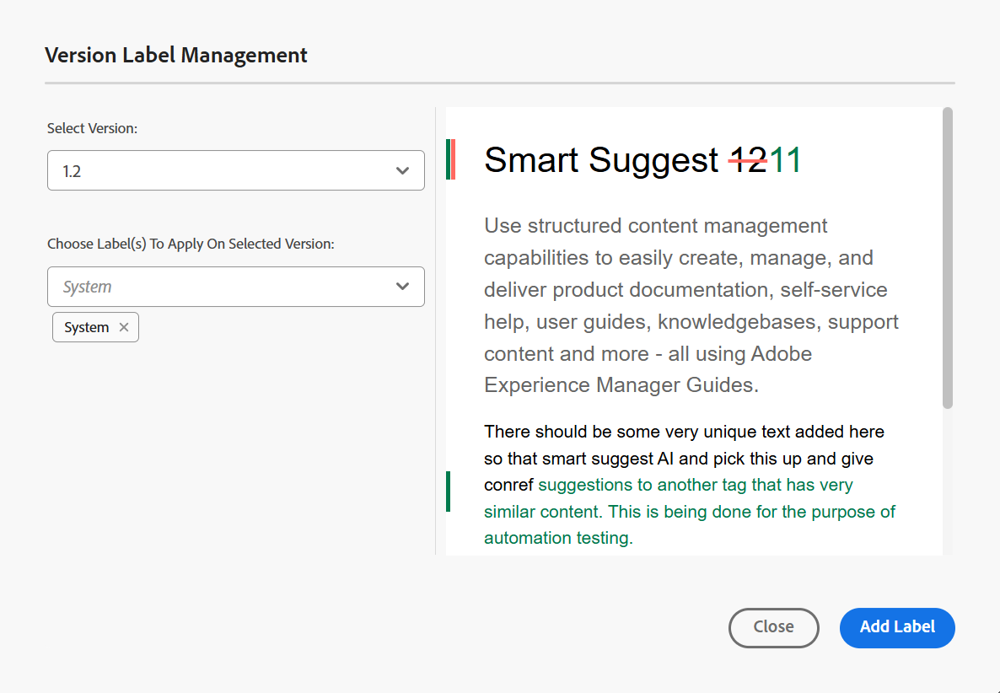
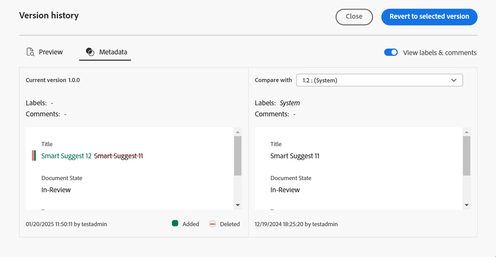
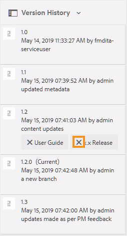

# Kennzeichnungen verwenden {#id164JBG0M0T1}

Adobe Experience Manager Guides ermöglicht das Hinzufügen von Beschriftungen zu verschiedenen Dateiversionen. Mit diesen Beschriftungen können Sie die Version angeben, die Sie in eine Baseline für die Veröffentlichung einbeziehen möchten. Weitere Informationen zur Verwendung von Kennzeichnungen zum Erstellen einer Grundlinie finden Sie unter [Arbeiten mit Grundlinien](generate-output-use-baseline-for-publishing.md#).

Wenn Sie z. B. *Version 1.0* eines Themas in *Version 1.0* und *Version 1.1* desselben Themas in *Version 2.0* verwenden möchten, können Sie *Version 1.0* Bezeichnung auf der *Version 1.0* und *Version 2.0* Bezeichnung auf der *Version 1.1* hinzufügen.

Nachdem Sie die Bezeichnungen hinzugefügt haben, können Sie eine Grundlinie erstellen und festlegen, welche Version des Themas zur Veröffentlichung mithilfe dieser Grundlinie einbezogen werden soll. Um anzuzeigen, welche Version in eine Baseline eingeschlossen oder ausgeschlossen werden soll, können Sie die Option Versionsverlauf verwenden.

## Hinzufügen einer Bezeichnung aus dem Editor

Führen Sie die folgenden Schritte aus, um Ihrem Thema über den Editor einen Titel hinzuzufügen:

1. Navigieren Sie im Repository-Bereich zu einem Thema und öffnen Sie es im Editor.
1. Wählen Sie **Versionsbezeichnung** aus der Dropdown-Liste **Menü** aus.

   {width="400" align="left"}

   Das **Versionskennzeichenverwaltung** wird angezeigt.

1. Wählen **Dialogfeld „Versionsbeschriftungsverwaltung** eine Version aus, der Sie einen Titel hinzufügen möchten.
1. Wählen Sie eine Bezeichnung für die ausgewählte Version aus und klicken Sie auf **Bezeichnung hinzufügen**.

   {width="650" align="left"}

   >[!NOTE]
   >
   > Es ist nicht möglich, den verschiedenen Versionen eines Themas dieselbe Beschriftung hinzuzufügen. Sie können derselben Version eines Themas jedoch mehrere Bezeichnungen hinzufügen.
1. Bestätigen Sie, dass Sie die Kennzeichnungen in der Bestätigungsaufforderung anwenden.

   Die Beschriftungen werden im Versionsverlauf des ausgewählten Themas angezeigt.

   {width="650" align="left"}

   >[!NOTE]
   >
   > Mithilfe einer Grundlinie können Sie einen Titel zu mehreren Themen hinzufügen. Weitere Informationen zum Hinzufügen von Kennzeichnungen über die Baseline finden Sie unter [Hinzufügen von Kennzeichnungen zu einer Baseline](generate-output-use-baseline-for-publishing.md#id184KD0T305Z).

Um eine Versionsbeschriftung aus einem Thema zu löschen, verwenden Sie das Symbol **Entfernen**, das für jede im Dialogfeld Versionsbeschriftungsverwaltung hinzugefügte Beschriftung bereitgestellt wird.

{align="left"}

## Arbeiten mit Kennzeichnungen über die Assets-Benutzeroberfläche

Sie können einem Thema auch Beschriftungen hinzufügen und diese nach Bedarf aus der Assets-Benutzeroberfläche löschen.

Führen Sie die folgenden Schritte aus, um Ihrem Thema über die Assets-Benutzeroberfläche einen Titel hinzuzufügen:

1. Wählen Sie in der Assets-Benutzeroberfläche ein Thema aus und öffnen Sie es.
1. Klicken Sie auf das Auswahlsymbol in der linken Leiste und wählen Sie **Versionsverlauf**.
1. Wählen Sie in der Dropdown-Liste Versionsverlauf eine Version aus, der Sie einen Titel hinzufügen möchten.
1. Geben Sie einen Titel für die ausgewählte Version ein und drücken Sie die Eingabetaste. Beispiel: *.6*.

   >[!NOTE]
   >
   > Es ist nicht möglich, den verschiedenen Versionen eines Themas dieselbe Beschriftung hinzuzufügen. Sie können derselben Version eines Themas jedoch mehrere Bezeichnungen hinzufügen.

   Die Beschriftungen werden im Versionsverlauf des ausgewählten Themas angezeigt. Im folgenden Screenshot werden die Bezeichnungen *x.x-Version* und *Benutzerhandbuch* angezeigt, die der hervorgehobenen Version des Themas hinzugefügt wurden.

   {width="300" align="left"}

>[!NOTE]
>
> Mithilfe einer Grundlinie können Sie einen Titel zu mehreren Themen hinzufügen. Weitere Informationen zum Hinzufügen von Kennzeichnungen über die Baseline finden Sie unter [Hinzufügen von Kennzeichnungen zu einer Baseline](generate-output-use-baseline-for-publishing.md#id184KD0T305Z).

Um eine Versionsbeschriftung aus einem Thema zu löschen, verwenden Sie die Schaltfläche **Löschen**, die für jede Beschriftung im Bereich Versionsverlauf bereitgestellt wird.

{width="300" align="left"}

**Übergeordnetes Thema:**&#x200B;[&#x200B; Einführung in den Editor](web-editor.md)
