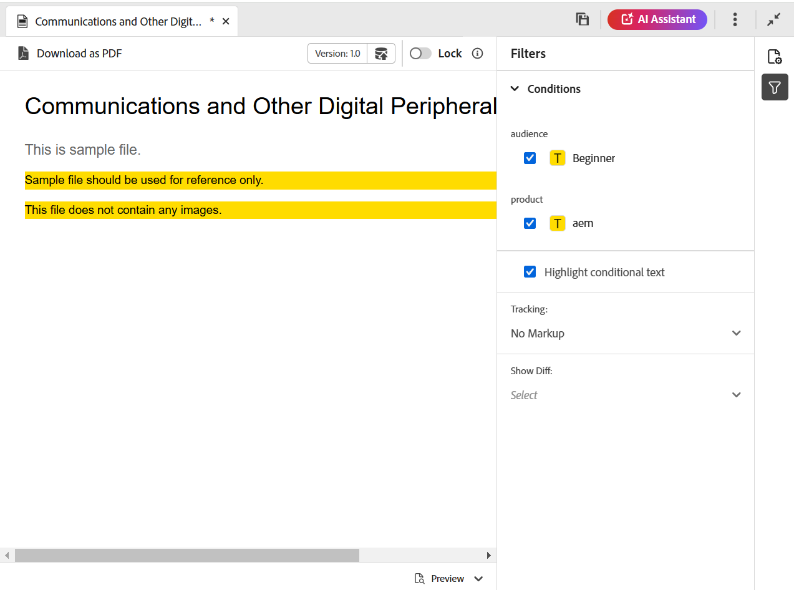

# Editor-Ansichten für Themen {#id204GK0D0V5Z}

Die Editor-Oberfläche in Adobe Experience Manager unterstützt die Anzeige von Themen in drei verschiedenen Modi oder Ansichten:

* [Author](#author)
* [Quelle](#source)
* [Vorschau](#preview)

## Author

Dies ist eine typische **des Editors (What You See Is What You Get** \(WYSISYG\). Sie können Themen wie in jedem normalen Rich-Text-Editor bearbeiten. In der Autorenansicht haben Sie die Möglichkeit, eine Revision des Dokuments zu speichern, Inhalte zu suchen und zu ersetzen, Elemente einzufügen, Hyperlinks einzufügen, Inhaltsreferenz einzufügen und vieles mehr.

>[!NOTE]
>
> Wenn Sie die Inhaltsreferenz verwenden, wird der referenzierte Inhalt auch in der Autorenansicht in blauer Farbe angezeigt. Der referenzierte Inhalt kann nicht bearbeitet werden.

## Quelle

Die Source-Ansicht zeigt die zugrunde liegende XML an, aus der das Thema besteht. Wenn Sie mit der direkten Arbeit mit XML vertraut sind, sollten Sie die Source-Ansicht verwenden. Zusätzlich zu den regulären Textbearbeitungen in dieser Ansicht können Sie mit dem Smart-Katalog auch Elemente und Attribute hinzufügen oder Text, Elemente oder Attribute suchen und ersetzen.

* Um den Smart-Katalog aufzurufen, platzieren Sie den Cursor an das Ende jedes Element-Tags, an dem Sie das neue Element einfügen möchten, und geben Sie &quot;&lt;&quot; ein. Der Editor zeigt eine Liste aller gültigen XML-Elemente an, die Sie an dieser Stelle einfügen können. Wählen Sie mit den Pfeiltasten das einzufügende Element aus und drücken Sie die Eingabetaste. Wenn Sie die schließende Klammer &quot;\> eingeben, wird automatisch das schließende Tag für das Element hinzugefügt.

  {width="400" align="left"}

* Sie können ein Element auch einfach über die Source-Ansicht ändern. Wenn Sie beispielsweise das öffnende Tag eines `p` Elements in `note` ändern, wird das schließende `p` Tag automatisch in `/note` geändert. Wenn Sie ein Element durch ein falsches Element ersetzen, wird Ihnen sofort der Validierungsfehler angezeigt.

* Wenn Sie einem Element ein Attribut hinzufügen möchten, platzieren Sie den Cursor in das Element-Tag und drücken Sie die Leertaste. Eine Liste gültiger Attribute für dieses Element wird im Smart-Katalog angezeigt. Verwenden Sie die Pfeiltasten, um das gewünschte Element auszuwählen, und drücken Sie die Eingabetaste , um das Element einzufügen. Um einen Wert für das Attribut anzugeben, geben Sie das Gleichheitszeichen \(=\) ein, und der Editor gibt automatisch die Anfangs- und Schlussanführungszeichen &quot;&quot; ein, in denen Sie den Wert des Attributs angeben können.

  {width="350" align="left"}

* In der Source-Ansicht gibt es eine Option für das automatische Einziehen, die den XML-Code in einem darstellbaren und leicht lesbaren Format neu organisiert. Wenn Sie außerdem einen Text auswählen und von der Autoren- zur Source- oder von der Source- zur Autorenansicht wechseln, wird der ausgewählte Text auch in der anderen Ansicht hervorgehoben.
* Eine weitere leistungsstarke Funktion in der Source-Ansicht ist die XML-Validierung in Ihrem Dokument. Wenn Sie ein Dokument öffnen, das ungültige XML enthält, wird es in der Source-Ansicht mit den Informationen zu ungültiger XML geöffnet. Im folgenden Screenshot sehen Sie beispielsweise die genauen Informationen über die fehlerhafte XML im Popup-Fenster „Fehler bei der Analyse“.

  {width="650" align="left"}

  Im obigen Screenshot wird eine Kreuzhervorhebung verwendet, um die Zeile mit fehlerhafter XML darauf hinzuweisen.

* Mit der Funktion „Suchen und Ersetzen“ können Sie in der Source-Ansicht nach beliebigen Texten, Elementen oder Attributen suchen.
Weitere Informationen finden Sie in der Beschreibung der Funktion **Suchen und Ersetzen** im Abschnitt [Registerkartenleiste](web-editor-tab-bar.md).

* Die Source-Ansicht bietet viele Tastaturbefehle, mit denen Sie schnell zu einem Dokument navigieren und es bearbeiten können. In der folgenden Tabelle sind die unterstützten Aktionen und ihre Tastaturbefehle aufgeführt:

  | Gehen Sie dazu folgendermaßen vor | Diese Tastenkombination verwenden |
  |----------|-----------------|
  | Mehrere Cursor hinzufügen | **Strg**+Linksklick |
  | Mehrere nicht aufeinander folgende Textauswahlen | **Strg**+Linksklick zum Ziehen und Auswählen von Text |
  | Text über und zwischen Zeilen auswählen | **Alt**+Linksklick zum Ziehen und Auswählen von Text |
  | Mehrfachauswahl rückgängig machen oder Vollbildmodus beenden | **ESC** |
  | Automatisch vervollständigen anzeigen | **Strg**+**Leertaste** |
  | Zum öffnenden oder schließenden Tag des aktuellen Tags gehen | **Strg**+**J** |
  | Das aktuelle Tag und seinen Inhalt erweitern oder reduzieren | **Strg**+**Q** |
  | Aktuelles Element und seinen Inhalt auswählen | **Strg**+**L** |
  | Ausrücken des aktuellen Elements | **Umschalt**+**Tab** |
  | Löscht das aktuelle Element und seinen Inhalt | **Umschalt**+**Strg**+**K** |
  | Cursor ein Wort nach links bewegen | **Alt**+**Nach-links-Taste** |
  | Cursor ein Wort nach rechts bewegen | **Alt**+**Nach-rechts-Taste** |
  | Eine Zeile nach oben scrollen, ohne die Cursorposition zu ändern | **Strg**+**Nach-oben-Taste** |
  | Eine Zeile nach unten scrollen, ohne die Cursorposition zu ändern | **Strg**+**Abwärtspfeil** |
  | Vollbild ein/aus | **F11** |
  | Fügt eine neue Zeile nach dem aktuellen Element ein | **Strg**+**Eingabetaste** |
  | Fügt eine neue Zeile vor dem aktuellen Element ein | **Umschalt**+**Strg**+**Eingabe** |
  | Sucht und wählt das nächste Vorkommen des aktuellen Wortes aus | **Strg**+**D** |
  | Aktuelles Element und dessen Inhalt um ein Element nach oben verschieben | **Umschalt**+**Strg**+**Nach-oben-Taste** |
  | Aktuelles Element und dessen Inhalt um ein Element nach unten verschieben | **Umschalt**+**Strg**+**Nach-unten-Taste** |
  | Aktuelles Element in Kommentar-Tag einschließen | **Strg**+**/** |
  | Aktuelles Element und seinen Inhalt duplizieren | **Umschalt**+**Strg**+**D** |
  | Text nach dem Cursor löschen. Wenn sich der Cursor vor einem öffnenden Element befindet, wird das gesamte Element gelöscht. | **Strg**+**K**+**K** |
  | Löscht den Text links vom Cursor in der aktuellen Zeile. Wenn sich der Cursor hinter dem schließenden -Tag eines Elements befindet, wird das gesamte Element gelöscht. | **Strg**+**K**+**Rücktaste** |
  | Konvertiert den aktuellen Text in Großbuchstaben | **Strg**+**K**+**U** |
  | Konvertiert den aktuellen Text in Kleinbuchstaben | **Strg**+**K**+**L** |
  | Scrollen Sie das aktuelle Element zur Mitte des Editors | **Strg**+**K**+**C** |
  | Einen Cursor über der aktuellen Position hinzufügen | **Strg**+**Alt**+**Nach-oben-Taste** |
  | Einen Cursor unterhalb der aktuellen Position hinzufügen | **Strg**+**Alt**+**Abwärtspfeil** |
  | Rekursives Auffinden des aktuellen Wortes \(in Vorwärtsrichtung\) | **Strg**+**F3** |
  | Rekursives Auffinden des aktuellen Wortes \(in Rückwärtsrichtung\) | **Umschalt**+**Strg**+**F3** |

## Vorschau

Beim Öffnen eines Themas im Vorschaumodus wird angezeigt, wie ein Thema angezeigt wird, wenn es von einem Benutzer im Browser angezeigt wird. Im Falle einer DITA-Karte wird eine Vorschau der Karte angezeigt, bei der ein einziges zusammengesetztes Dokument aller Themen innerhalb der Karte angezeigt wird.

Der Vorschaumodus bietet die folgenden Funktionen:

* [Inhalte basierend auf bedingten Filtern anzeigen](#id2114BI00VXA)
* [Anzeigen der Markierungen zum Nachverfolgen von Änderungen](#id2114BJ00CE8)
* [Thema als PDF exportieren](#id2114BL00B5U)

### Inhalte basierend auf bedingten Filtern anzeigen {#id2114BI00VXA}

Wenn Sie Bedingungen in Ihrem Thema oder Ihrer Karte verwendet haben, werden diese Bedingungen im Bedienfeld Filter angezeigt. Standardmäßig sind alle Bedingungen ausgewählt und der gesamte Inhalt wird angezeigt. Wenn Sie die Auswahl einer Bedingung aufheben, wird der Inhalt mit dieser Bedingung aus der Ansicht entfernt. Sie können auch bedingte Inhalte hervorheben.

Die folgende Abbildung zeigt ein Thema, das zwei Bedingungen verwendet - `Audience` und `Product`. Der bedingte Inhalt wird mit gelbem Hintergrund hervorgehoben.

{align="left"}

### Anzeigen der Markierungen zum Nachverfolgen von Änderungen {#id2114BJ00CE8}

Wenn ein Dokument Markierungen enthält, die Änderungen verfolgen \(oder visuelle Hinweise\), können Sie das Dokument auch mit oder ohne diese Markierungen in der Vorschau anzeigen. Bei der Vorschau eines Dokuments enthält das rechte Bedienfeld die Filter und Tracking-Optionen.

{width="400" align="left"}

Es gibt drei **Tracking**-Optionen, aus denen Sie wählen können:

* **Kein Markup**: In dieser Ansicht werden alle Einfügungen und Löschungen akzeptiert, und eine einfache Ansicht des Dokuments wird angezeigt. In dieser Ansicht werden keine Markups für das Tracking von Änderungen angezeigt.
* **Original**: In dieser Ansicht werden alle Einfügungen abgelehnt, alle Löschungen werden wiederhergestellt und eine Vorschau wird angezeigt. Einfach gesagt, Sie erhalten die Originalform des Dokuments, bevor Sie den Modus Änderungen nachverfolgen aktiviert haben.
* **Markup anzeigen**: In dieser Ansicht erhalten Sie alle Markierungen für eingefügte und gelöschte Inhalte.

  Die folgende Abbildung zeigt die Vorschau einer Zuordnungsdatei mit Markierungen:

  {width="300" align="left"}

### Thema als PDF exportieren {#id2114BL00B5U}

PDF ist eines der gängigsten Ausgabeformate, die in jeder möglichen Phase des Dokumentenentwicklungszyklus verwendet werden. Experience Manager Guides bietet Ihnen die Flexibilität, die PDF eines einzelnen Themas oder eine gesamte Zuordnungsdatei zu generieren. Mit der Funktion „Als PDF exportieren“ können Autor, Publisher oder Admin einfach die PDF-Ausgabe für ein einzelnes Thema generieren. Sie verwendet die im Profil auf Ordnerebene gespeicherten DITA-OT-Konfigurationen, um die PDF zu generieren.

Diese Funktion unterstützt die folgenden Funktionen:

* Erzeugt den PDF der aktuell aktiven Arbeitskopie eines Themas.
* Akzeptieren Sie den DITA-OT-Umwandlungsnamen und die Befehlszeilenargumente, um die PDF zu generieren.
* Speichern Sie die generierte Ausgabe auf dem lokalen System.
* Lösen Sie die im Thema verwendeten Schlüssel- und Inhaltsreferenzen auf, bevor Sie die Ausgabe generieren.

Gehen Sie wie folgt vor, um ein Thema als PDF zu exportieren:

1. Öffnen Sie das Thema im Vorschaumodus. Stellen Sie sicher, dass das Thema Teil einer Zuordnungsdatei ist.

1. Wählen Sie oben **die Option** Als PDF herunterladen“ aus.

   .

   >[!NOTE]
   >
   > Vergewissern Sie sich, dass Sie das Popup-Fenster in der Browser-Konfiguration aktiviert haben, da der PDF sonst nicht heruntergeladen wird.

   Die PDF wird generiert und in einer neuen Registerkarte geöffnet. Andernfalls wird ein Dialogfeld zum Speichern der PDF auf Ihrem lokalen System angezeigt.

**Übergeordnetes Thema:**[ Einführung in den Editor](web-editor.md)
