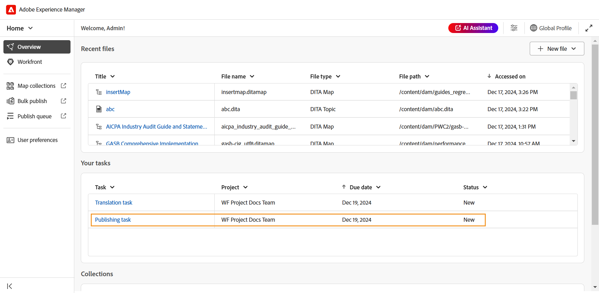

# Workfront-Integration

Adobe Workfront ist eine Cloud-basierte Lösung für das Arbeits-Management, mit der Teams und Unternehmen ihre Arbeit effizient planen, verfolgen und verwalten können. Durch die Integration von Experience Manager Guides mit Adobe Workfront erhalten Sie Zugriff auf zuverlässige Projektmanagement-Funktionen, die die zentralen CCMS-Funktionen von Experience Manager Guides ergänzen und es Ihnen ermöglichen, Aufgaben effizient zu planen, zuzuweisen und nachzuverfolgen.

Mit dieser Integration können Sie Adobe Workfront-Aufgaben direkt in Experience Manager Guides erstellen und verwalten. Beispielsweise können Sie als Autor eine Prüfungsaufgabe (mit einem oder mehreren hinzugefügten DITA-Themen oder -Karten) direkt in der Experience Manager Guides-Oberfläche erstellen und sie einem Reviewer zuweisen. Als Prüferin bzw. Prüfer können Sie in der Experience Manager Guides-Prüfbenutzeroberfläche zugewiesene Aufgaben bearbeiten und diese mit Kommentaren an die Autorin bzw. den Autor zurückgeben. Ebenso können Sie eine Veröffentlichungs- und Übersetzungsaufgabe erstellen und sie dann den Benutzern zuweisen, die sie bearbeiten müssen.

Die Integration bietet Ihnen außerdem die Möglichkeit, Ihre Arbeitswarteschlangen zu überwachen und sicherzustellen, dass Sie über alle Aufgaben (zugewiesene Aufgaben) auf dem Laufenden bleiben.

**Wichtigste Funktionen**

Mit der Integration von Experience Manager Guides und Adobe Workfront können Sie:

* Planen, zuweisen und verfolgen Sie den Fortschritt einzelner Aufgaben und Projekte, ohne sich auf mehrere, nicht integrierte Tools verlassen zu müssen.
* Effizienteres Verwalten aller Experience Manager Guides-Workflows, einschließlich Inhaltserstellung, -überprüfung, -veröffentlichung und -übersetzung.
* Sie erhalten bei jeder Zuweisung neuer Aufgaben E-Mail-Benachrichtigungen von Adobe Workfront. Weitere Informationen finden Sie unter [Benachrichtigungen - Übersicht](https://experienceleague.adobe.com/en/docs/workfront/using/basics/use-notifications/wf-notifications).
* Überwachen Sie den Projektzustand mithilfe des intuitiven Dashboards von Adobe Workfront, das Echtzeit-Einblicke in die Projektleistung bietet.

  Weitere Informationen zu den robusten Projektmanagement-Funktionen von Adobe Workfront für Projektmanager in Experience Manager Guides finden Sie unter [Projektübersicht planen](https://experienceleague.adobe.com/en/docs/workfront/using/manage-work/projects/plan-a-project/plan-project).

## Erste Schritte

Nach der Konfiguration und Aktivierung durch Ihren Administrator können Sie direkt über die [Experience Manager Guides-Startseite auf Adobe Workfront-Aufgaben zugreifen](./intro-home-page.md).

Führen Sie die folgenden Schritte aus, um auf Ihre Adobe Workfront-Aufgaben zuzugreifen:

1. Melden Sie sich bei Experience Manager Guides an und öffnen Sie **Startseite**.
2. Wählen Sie im linken Bedienfeld **Workfront** aus.

   Die Seite **Workfront** Aufgaben“ wird angezeigt.

   {align="left"}
3. Wählen Sie **Anmelden** aus.

   Sie werden zur Anmeldeseite von Adobe Workfront weitergeleitet.
4. Melden Sie sich mit derselben E-Mail-Adresse an wie in Experience Manager Guides und wählen Sie dann **Zugriff zulassen** aus, damit die Anwendung auf Ihr Adobe Workfront-Konto zugreifen kann.

   Sie werden automatisch zur Seite **Workfront-Aufgaben** in Experience Manager Guides weitergeleitet.

   {align="left"}

## Auf der Workfront-Aufgabenseite verfügbare Funktionen

Die folgenden Funktionen sind auf der Seite Workfront-Aufgaben verfügbar:

* [Neue Aufgabe](#create-workfront-tasks): Ermöglicht das Erstellen von Adobe Workfront-Aufgaben direkt über die Experience Manager Guides-Benutzeroberfläche.
* [Ihnen zugewiesen](#managing-tasks-assigned-to-you): Listet alle Aufgaben auf, die Ihnen zugewiesen sind und noch aktiv sind.
* [Von Ihnen erstellt](#managing-tasks-created-by-you): Listet alle Aufgaben auf, die Sie erstellt haben und noch aktiv sind.

Die Workfront-Aufgabenseite enthält auch das Symbol Link out  , über das Sie, wenn Sie es auswählen, zur Adobe Workfront-Projektseite gelangen. Hier können Sie Aufgabendetails anzeigen, Kommentare anzeigen, Kommentare hinzufügen und basierend auf den Berechtigungen, die Ihrem Adobe Workfront-Konto zugeordnet sind, auf andere Funktionen zugreifen.

Weitere Informationen finden Sie unter [Übersicht über die Projekt-, Aufgaben- und Problemdaten in Workfront](https://experienceleague.adobe.com/en/docs/workfront/using/basics/navigate/definitions-pti-dates).

### Workfront-Aufgaben erstellen

Sie können Adobe Workfront-Aufgaben direkt über die Benutzeroberfläche von Experience Manager Guides erstellen, indem Sie die Schaltfläche **Neue Aufgabe** auf der Seite Workfront-Aufgaben verwenden.

Führen Sie die folgenden Schritte aus, um eine neue Adobe Workfront-Aufgabe zu erstellen:

1. Wählen Sie auf der Seite Workfront-Aufgaben **Neue Aufgabe** aus.

   Das **Aufgabe erstellen** wird angezeigt.

   {align="left"}
2. Geben **auf der Registerkarte** Allgemein“ die folgenden Aufgabendetails ein:

   * **Aufgabentyp**: Wählen Sie den Aufgabentyp aus, den Sie erstellen möchten. Die verfügbaren Optionen sind: **Authoring**, **Überprüfen**, **Publishing** und **Übersetzung**.
   * **Projekt**: Wählen Sie das Projekt aus, in dem Sie die Aufgabe erstellen möchten.
   * **Aufgabenname**: Geben Sie einen beschreibenden Namen für die Aufgabe ein.
   * **Beschreibung**: Geben Sie eine kurze Beschreibung der Aufgabe ein.
   * **Fällig am**: Legen Sie das Fälligkeitsdatum für den Abschluss der Aufgabe fest.
   * **Verantwortlicher**: Wählen Sie einen Verantwortlichen für die Aufgabe aus.
3. Assets Wählen Sie auf der Registerkarte **0&rbrace; die Option** Hinzufügen **aus, um dieser Aufgabe ein Asset hinzuzufügen.**

   {align="left"}

   Das **Pfad auswählen** wird angezeigt. Wählen Sie einen Pfad zum gewünschten Asset aus. Sie können mehrere Assets hinzufügen, indem Sie die gültigen Pfade im Pfad-Browser auswählen. Die ausgewählten Pfade werden beibehalten, sodass Sie sie beim erneuten Öffnen des Dialogfelds einfach überprüfen oder ändern können.

   * Bei Aufgaben des Erstellens, Veröffentlichens und Übersetzens werden Sie aufgefordert, den Speicherort der erforderlichen Datei im Dialogfeld **Pfad auswählen** auszuwählen. Die ausgewählte Datei (ein Thema für die Bearbeitung und Zuordnung zur Veröffentlichung und Übersetzung) wird der Aufgabe hinzugefügt, sobald die Schaltfläche **Erstellen** ausgewählt wird.

     {align="left"}

   * Bei Prüfungsaufgaben werden Sie zunächst aufgefordert, den Asset-Typ (Zuordnung oder Themen) auszuwählen, und dann werden die ausgewählten Dateien wie folgt angezeigt:

     {align="left"}

     *Hinzufügen von Themen zu einer Prüfungsaufgabe*

     {align="left"}

     *Hinzufügen von Zuordnungen zu einer Prüfungsaufgabe*

     Die folgenden Aktionen stehen zur Verfügung, um Ihre Auswahl vor dem Versand zur Überprüfung zu ändern:

      * Heben Sie die Auswahl einiger Themen aus der Liste auf.
      * Filtern Sie die Themenliste nach dem Dokumentstatus.
      * Bearbeiten Sie je nach Bedarf die Version der ausgewählten Themen **Neueste Version**, **Version basierend auf**) und **Grundlinie** (nur für Karten verfügbar).

     Weitere Informationen finden Sie unter [Themen zur Überprüfung senden](./review-send-topics-for-review.md).

   >[!NOTE]
   >
   > Das Hinzufügen eines Assets zu einer Aufgabe bietet den Bevollmächtigten schnellen Zugriff auf ein Thema, eine Zuordnung oder eine andere Datei, die sie bearbeiten müssen. Bei Aufgaben des Verfassens, Veröffentlichens und Übersetzens ist das Hinzufügen eines Assets optional, kann aber zur Optimierung von Workflows hilfreich sein. Bei Prüfungsaufgaben ist das Hinzufügen eines Assets jedoch obligatorisch.

4. Wählen Sie **Erstellen** aus.

Eine neue Aufgabe wird erstellt und auf der Registerkarte **Erstellt von Ihnen** aufgeführt.

>[!NOTE]
>
> Als Projekt-Manager können Sie diese neu erstellte Aufgabe zusammen mit anderen wichtigen Aufgabendetails in Ihrem Adobe Workfront-Dashboard anzeigen. Weitere Informationen finden Sie unter [Grundlegendes zu Dashboards](https://experienceleague.adobe.com/en/docs/workfront/using/reporting/dashboards/understand-dashboards/understand-dashboards).

### Verwalten der von Ihnen erstellten Aufgaben

Alle Aufgaben, die Sie erstellt haben und noch aktiv sind, werden auf der Seite &quot;Workfront-Aufgaben **auf der Registerkarte &quot;** erstellt“ angezeigt und geben Ihnen wichtige Aufgabendetails wie Projektname, Verantwortliche, Erstellungsdatum der Aufgabe, Abschlussdatum der Aufgabe und Aufgabenstatus.

{align="left"}

Die folgenden Optionen sind verfügbar, wenn Sie den Mauszeiger über eine Aufgabe bewegen, die auf der Registerkarte Erstellt von Ihnen vorhanden ist:

**Öffnen** - 

Ermöglicht das Öffnen der Aufgabe. Je nach Aufgabentyp wird sie im Editor, in der Zuordnungskonsole oder in der Benutzeroberfläche „Überprüfen“ geöffnet.

**Bearbeiten** - 

Hiermit können Sie Aufgabendetails bearbeiten, die beim Erstellen der Aufgabe hinzugefügt wurden. Alle Felder außer Aufgabentyp und Projekt können bearbeitet werden. Sie können nur Aufgaben bearbeiten, die von Ihnen erstellt wurden. Zugewiesene Aufgaben können nicht bearbeitet werden

Außerdem können Sie beim Bearbeiten einer Authoring-, Publishing- oder Übersetzungsaufgabe Assets hinzufügen oder entfernen. Bei einer Prüfungsaufgabe können Sie jedoch nur die Version der Assets ändern, die zur Überprüfung gesendet werden.

**Aufgabendetails** - 

Zeigt die Aufgabeninformationen an, einschließlich der bei der Aufgabenerstellung eingegebenen Details, des Aufgabenstatus und aller hinzugefügten Assets.

### Verwalten der Ihnen zugewiesenen Aufgaben

Alle Aufgaben, die Ihnen zugewiesen sind und noch aktiv sind, werden auf der Seite Workfront-Aufgaben auf der Registerkarte **Ihnen zugewiesen** angezeigt. Dort finden Sie die wichtigsten Aufgabendetails wie Projektname, Beauftragte, Fälligkeitsdatum und Aufgabenstatus.

{align="left"}

Die folgenden Optionen sind verfügbar, wenn Sie den Mauszeiger über eine Aufgabe bewegen, die auf der Registerkarte Zugewiesen an Sie vorhanden ist:

**Öffnen** - 

Ermöglicht das Öffnen der Aufgabe. Je nach Aufgabentyp wird sie im Editor, in der Zuordnungskonsole oder in der Benutzeroberfläche „Überprüfen“ geöffnet.

**Aufgabendetails** - 

Zeigt die Aufgabeninformationen an, einschließlich der bei der Aufgabenerstellung eingegebenen Details, des Aufgabenstatus und aller hinzugefügten Assets.

{align="left"}

#### Zugreifen auf zugewiesene Aufgaben über den Abschnitt „Übersicht“

Sie können auch über den Abschnitt „Übersicht“ auf [ zugewiesenen Aufgaben ](./intro-home-page.md#overview) Adobe Workfront zugreifen. Wenn der Abschnitt Übersicht ausgewählt ist, enthält er verschiedene Widgets, die Ihnen helfen, fokussiert und organisiert zu bleiben.

**Ihre Aufgaben** ist ein solches Widget, in dem eine Liste der Adobe Workfront-Aufgaben (die Ihnen zugewiesen sind und noch aktiv sind) zusammen mit den wichtigsten Aufgabendetails, einschließlich Name der Aufgabe, verknüpftes Projekt, Fälligkeitsdatum und aktueller Status, angezeigt wird.

{align="left"}

Ähnlich wie die Registerkarte Ihnen zugewiesen bietet das Widget Ihre Aufgaben auch Optionen zum **Öffnen** und Anzeigen **Aufgabendetails** wenn Sie den Mauszeiger über eine Aufgabe bewegen.

Das Widget bietet außerdem Optionen zum Sortieren und Ändern der Größe von Spalten für eine benutzerdefinierte Ansicht. Um eine Sortierung auf eine Spalte anzuwenden, wählen Sie die Spaltenüberschrift aus. Die Optionen werden dann in einer Liste angezeigt. Um die Breite einer Spalte anzupassen, bewegen Sie den Mauszeiger über die Spaltentrennlinie in der Kopfzeile und ziehen Sie dann, um die Größe zu ändern.

>[!NOTE]
>
> Wenn Sie sich nicht in der Experience Manager Guides-Benutzeroberfläche befinden, erhalten Sie von Adobe Workfront eine E-Mail-Benachrichtigung für neu zugewiesene Aufgaben. Melden Sie sich zum Auschecken dieser Aufgaben bei Ihrer Experience Manager Guides-Instanz an und greifen Sie auf die zugewiesenen Aufgaben zu.

## Arbeiten mit Adobe Workfront-zugewiesenen Aufgaben

Es gibt vier Arten von Adobe Workfront-Aufgaben, die Sie erstellen und dann zuweisen oder bearbeiten können, wenn sie in Experience Manager Guides zugewiesen werden:

1. [Authoring - Aufgaben](#authoring-tasks)
2. [Aufgaben überprüfen](#review-tasks)
3. [Übersetzungsaufgaben](#translation-tasks)
4. [Veröffentlichungsaufgaben](#publishing-tasks)

Die folgenden Abschnitte führen Sie durch den detaillierten Prozess der Arbeit an zugewiesenen Adobe Workfront-Aufgaben.

### Authoring - Aufgaben

Führen Sie die folgenden Schritte aus, um eine Authoring-Aufgabe zu bearbeiten:

1. Greifen Sie auf die Aufgabe entweder über den Abschnitt [Übersicht](#accessing-assigned-tasks-from-overview-section) oder [Ihnen zugewiesen](#managing-tasks-assigned-to-you) zu.

   {align="left"}

   *Bearbeitungsaufgabe auf der Registerkarte Zugewiesen an Sie*

   {align="left"}

   *Authoring-Aufgabe im Widget „Ihre Aufgaben“*
2. Bewegen Sie den Mauszeiger über die Aufgabe, an der Sie arbeiten möchten, und wählen Sie sie aus.    um es zu öffnen. Sie können die Aufgabe auch öffnen, indem Sie einfach die Aufgabe auswählen.

   Alle Bearbeitungsaufgaben werden im Editor geöffnet.
3. Überprüfen Sie die Aufgabendetails auf der Registerkarte **Details** und wählen Sie die **Asset**-Datei aus, um sie zu öffnen.

   {align="left"}

4. Nehmen Sie die erforderlichen Änderungen vor und wählen **Als erledigt markieren**.
5. Wechseln Sie zur Registerkarte **Kommentare**, um dieser Aufgabe einen Kommentar hinzuzufügen. Diese Kommentare, die auf Aufgabenebene hinzugefügt werden, spiegeln auch das Adobe Workfront-Projekt-Dashboard wider.

   >[!NOTE]
   >
   > Sobald die Aufgabe als „Erledigt“ markiert ist, wird sie sowohl aus der Liste der zugewiesenen Aufgaben als auch aus der Aufgabenliste **Erstellt von Ihnen** des Aufgabeninitiators entfernt.

### Aufgaben überprüfen

Als Reviewer können Sie die Ihnen zugewiesenen Adobe Workfront-Prüfungsaufgaben überprüfen.

Führen Sie die folgenden Schritte aus, um an einer Prüfungsaufgabe zu arbeiten, die Ihnen zugewiesen wurde.

1. Greifen Sie auf die Aufgabe entweder über den Abschnitt [Übersicht](#accessing-assigned-tasks-from-overview-section) oder [Ihnen zugewiesen](#managing-tasks-assigned-to-you) zu.

   {align="left"}

   *Prüfungsaufgabe auf der Registerkarte Zugewiesen an Sie*

   {align="left"}

   *Authoring-Aufgabe im Widget „Ihre Aufgaben“*
2. Bewegen Sie den Mauszeiger über die Aufgabe, an der Sie arbeiten möchten, und wählen Sie sie aus.    um es zu öffnen. Sie können die Aufgabe auch öffnen, indem Sie einfach die Aufgabe auswählen.

   Für Reviewer wird die Überprüfungsaufgabe in der **Überprüfungs-Benutzeroberfläche“**.

   {align="left"}

3. Führen Sie die erforderliche Überprüfung durch. Weitere Informationen zum Überprüfen eines Themas finden Sie unter [Themen überprüfen](./review-topics.md).
4. Nachdem die Überprüfung abgeschlossen ist, wählen Sie **Als abgeschlossen markieren** aus.
5. Wechseln Sie zur Registerkarte **Kommentare**, um dieser Aufgabe einen Kommentar hinzuzufügen. Diese Kommentare, die auf Aufgabenebene hinzugefügt werden, spiegeln auch das Adobe Workfront-Projekt-Dashboard wider.

Wenn Sie die Aufgabe als von einem Validierungsverantwortlichen erledigt markieren, wird damit nicht der Abschluss der Aufgabe angezeigt. Alle Prüfungsaufgaben werden dem Benutzer zurückzugewiesen, der die Aufgabe erstellt hat (im Idealfall ein Autor, der eine Überprüfung angefordert hat).

>[!NOTE]
>
> Wenn die Aufgabe mehreren Reviewern zugewiesen ist, wird sie erst dann dem Ersteller der Aufgabe zugewiesen, nachdem alle Reviewer sie als erledigt markiert haben.

Prüfungsaufgaben, die dem Ersteller bzw. den Autoren zur Aufnahme in die Überprüfung neu zugewiesen wurden, sind im Abschnitt [Übersicht](#accessing-assigned-tasks-from-overview-section) oder auf der Registerkarte [Ihnen zugewiesen](#managing-tasks-assigned-to-you) verfügbar.

{align="left"}

*Prüfungsaufgabe wurde Autorinnen und Autoren zurückzugewiesen*

Für solche Aufgaben ändert sich der Aufgabenstatus für den Verantwortlichen in **Authoring**, während der Aufgabentyp **Überprüfen** bleibt. Diese Statusänderung erfolgt, wenn die Überprüfung von allen Reviewern abgeschlossen wird.

{align="left"}

Wenn Sie die Aufgabe oder das Symbol Öffnen auswählen,  die Aufgabe im Editor geöffnet wird, in dem der Autor [Prüfungskommentare adressieren](../user-guide/review-address-review-comments.md) die Aufgabe bearbeiten, indem er die Version der Themen aktualisiert, und dann die Aufgabe bei Bedarf wieder dem Reviewer zuweisen kann.

Der Autor kann die Aufgabe auch bearbeiten und sie einem anderen Autor zuweisen, indem er die Aufgabe der Einbindung der Kommentare delegiert. Wählen Sie dazu **Bearbeiten**, ändern Sie den Aufgabenstatus in **Authoring** und wählen Sie dann **Bevollmächtigten ändern**. Sie können jetzt einen Verantwortlichen aus der Liste auswählen.

Dieser Prozess bildet einen kontinuierlichen Zyklus, in dem die Aufgabe zwischen Autor und Prüfer hin und her verschoben wird, bis sie vollständig abgeschlossen ist. Sobald alle vorgeschlagenen Änderungen übernommen wurden, kann der Autor die Aufgabe abschließen, indem er **Als erledigt markieren** auswählt.

### Übersetzungsaufgaben

Sie können verschiedene Übersetzungsaktionen für Adobe Workfront-Übersetzungsaufgaben durchführen, die Ihnen zugewiesen sind.

Führen Sie die folgenden Schritte aus, um eine Übersetzungsaufgabe zu bearbeiten:

1. Greifen Sie auf die Aufgabe entweder über den Abschnitt [Übersicht](#accessing-assigned-tasks-from-overview-section) oder [Ihnen zugewiesen](#managing-tasks-assigned-to-you) zu.

   {align="left"}

   *Übersetzungsaufgabe auf der Registerkarte „Ihnen zugewiesen“*

   {align="left"}

   *Übersetzungsaufgabe im Widget „Ihre Aufgaben“*

2. Bewegen Sie den Mauszeiger über die Aufgabe, an der Sie arbeiten möchten, und wählen Sie sie aus.    , um sie in der **Map-Konsole“**. Sie können die Aufgabe auch öffnen, indem Sie einfach die Aufgabe auswählen.
3. Überprüfen Sie die Aufgabendetails und die zur Übersetzung hinzugefügte Datei.

   {align="left"}
4. Navigieren Sie zur **Übersetzung** für die verschiedenen Übersetzungsoptionen. Erfahren Sie, wie [Inhalte übersetzen](../user-guide/translation.md) in Experience Manager Guides.
5. Führen Sie die gewünschte Übersetzung aus und wählen Sie **Zur Übersetzung senden**.
   {align="left"}
6. Navigieren Sie zum Abschnitt **Workfront** und wählen Sie **Als abgeschlossen markieren** aus, um anzugeben, dass die Aufgabe abgeschlossen ist.
7. Wechseln Sie zur Registerkarte **Kommentare**, um dieser Aufgabe einen Kommentar hinzuzufügen. Diese Kommentare, die auf Aufgabenebene hinzugefügt werden, spiegeln das Adobe Workfront-Projekt-Dashboard wider.

   >[!NOTE]
   >
   > Sobald die Aufgabe als „Erledigt“ markiert ist, wird sie sowohl aus der Liste der zugewiesenen Aufgaben als auch aus der Aufgabenliste **Erstellt von Ihnen** des Aufgabeninitiators entfernt.

### Veröffentlichungsaufgaben

Als Herausgeber können Sie Details anzeigen und eine Veröffentlichungsaufgabe veröffentlichen, die Ihnen zugewiesen wurde.

Führen Sie die folgenden Schritte aus, um an einer Veröffentlichungsaufgabe zu arbeiten:

1. Greifen Sie auf die Aufgabe entweder über den Abschnitt [Übersicht](#accessing-assigned-tasks-from-overview-section) oder [Ihnen zugewiesen](#managing-tasks-assigned-to-you) zu.

   {align="left"}

   *Veröffentlichungsaufgabe auf der Registerkarte „Ihnen zugewiesen“*

   {align="left"}

   *Veröffentlichungsaufgabe im Widget „Ihre Aufgaben“*
2. Bewegen Sie den Mauszeiger über die Aufgabe, an der Sie arbeiten möchten, und wählen Sie sie aus.    , um sie in der **Map-Konsole“**. Sie können die Aufgabe auch öffnen, indem Sie einfach die Aufgabe auswählen.
3. Überprüfen Sie die Aufgabendetails und die zur Veröffentlichung hinzugefügte Datei.

   {align="left"}
4. Navigieren Sie zu **Ausgabevorgaben** und führen Sie die zum Veröffentlichen der Aufgabe erforderlichen Veröffentlichungsaktionen aus. Weitere Informationen finden Sie unter [Grundlegendes zu Ausgabevorgaben](../user-guide/generate-output-understand-presets.md/).
5. Navigieren Sie nach Abschluss der Veröffentlichung zum Abschnitt **Workfront** und wählen Sie **Als abgeschlossen markieren** aus, um anzugeben, dass die Aufgabe abgeschlossen ist.
6. Wechseln Sie zur Registerkarte **Kommentare**, um dieser Aufgabe einen Kommentar hinzuzufügen. Diese Kommentare, die auf Aufgabenebene hinzugefügt werden, spiegeln das Projekt-Dashboard von Workfront wider.

   >[!NOTE]
   >
   > Sobald die Aufgabe als „Erledigt“ markiert ist, wird sie sowohl aus der Liste der zugewiesenen Aufgaben als auch aus der Aufgabenliste **Erstellt von Ihnen** des Aufgabeninitiators entfernt.
