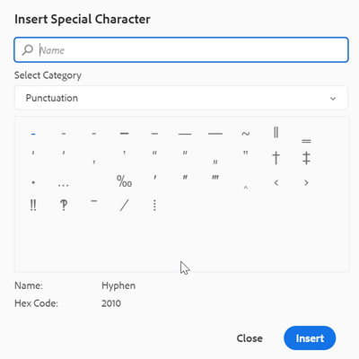
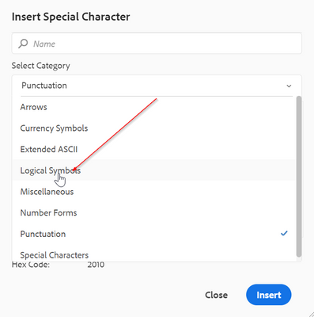
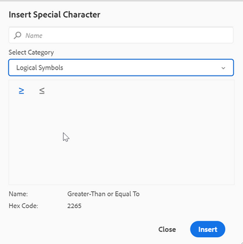

# Konfigurieren zusätzlicher Sonderzeichen in der Editor-Symbolleiste für On-Premise

In der Symbolleiste des Web-Editors gibt es eine Verknüpfungsoption, mit der der Autor die Sonderzeichen bereits einfügen kann.
Dasselbe kann im folgenden Screenshot gezeigt werden:




Diese Liste von Zeichen kann hier konfiguriert werden. Wenn Sie mehr Zeichen zu diesem Feld hinzufügen müssen, führen Sie die folgenden Schritte aus:

+ Melden Sie sich bei AEM an und öffnen Sie den CRXDE Lite-Modus.

+ Erstellen Sie die Datei „symbols.json“ am folgenden Speicherort: &quot;/apps/fmdita/xmeditor/&quot; (Sie können den Standardwert vom Speicherort &quot;/libs/fmdita/clientlibs/clientlibs/xmleditor/symbols.json&quot; kopieren)

+ Fügen Sie die Sonderzeichendefinition in der Datei „symbols.json“ wie folgt hinzu:

```
{
      "label": "Logical Symbols",
      "items": [
        {
          "name": "≥",
          "title": "Greater-Than or Equal To"
        },
        {
          "name": "≤",
          "title": "Smaller-Than or Equal To"
        }
      ]
}
```

Die Struktur der Datei „symbols.json“ wird nachfolgend erläutert:

+ „label“: „Logical Symbols“: Legt die Kategorie der Sonderzeichen fest. Im Snippet wird eine Kategorie mit dem Namen „Logisches Symbol“ definiert.

+ „items“: Damit wird die Sammlung von Sonderzeichen in der Kategorie definiert.

+ „name“: &quot;≥&quot;, „title“: „größer oder gleich“: Dies ist die Definition des Sonderzeichens. Sie beginnt mit der Bezeichnung „Name“, die nicht geändert werden darf. Auf den Namen folgt das Sonderzeichen. Der „Titel“ ist der Name oder Titel des Sonderzeichens, das als QuickInfo für dieses Sonderzeichen angezeigt wird.

Sie können mehrere Definitionen von Sonderzeichen innerhalb einer Kategorie definieren.

Dadurch wird eine weitere Kategorie in das Dialogfeld Sonderzeichen eingefügt:





>[!MORELIKETHIS]
>
>+ [Installations- und Konfigurationshandbuch](https://helpx.adobe.com/content/dam/help/en/xml-documentation-solution/3-6/XML-Documentation-for-Adobe-Experience-Manager_Installation-Configuration-Guide_EN.pdf)
