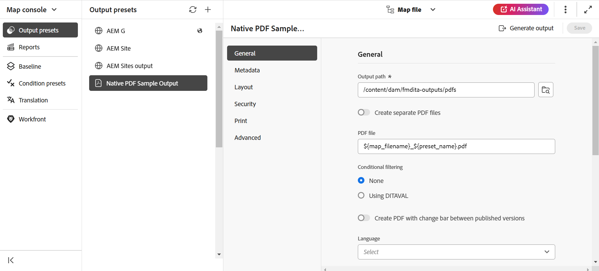

# Publish PDF-Ausgabe

Mit AEM Guides können Sie PDF einzelner Themen oder eine gesamte Zuordnungsdatei generieren. Sie können Ihre Inhalte mit einer der drei folgenden Methoden in einem PDF-Format veröffentlichen:

* **DITA-OT**

Verwenden Sie diese Methode, um eine PDF-Ausgabe für eine Zuordnung aus dem Zuordnungs-Dashboard zu generieren. Sie können die Veröffentlichungseigenschaften vor dem Generieren der PDF festlegen, indem Sie eine Ausgabevorgabe für die Zuordnung erstellen, die im Zuordnungs-Dashboard geöffnet ist. Um eine Ausgabevorgabe zu erstellen oder zu bearbeiten, *Sie im [AEM Guides as a Cloud Service* Benutzerhandbuch den Abschnitt „Grundlagen zu den Ausgabevorgaben](https://helpx.adobe.com/content/dam/help/en/xml-documentation-solution/cs-apr-22/XML-Documentation-for-Adobe-Experience-Manager_CS_User-Guide_EN.pdf).

Weitere Informationen zum Generieren einer PDF mit der DITA-OT-Methode finden Sie unter [Generieren einer PDF mit DITA-OT](https://help.adobe.com/en_US/xml-documentation-for-adobe-experience-manager/index.html#t=DXML-master-map%2Fgenerate-output-pdf.html).

* **FrameMaker Publishing Server (FMPS)**

Verwenden Sie diese Methode, um eine PDF-Ausgabe nicht nur aus dem DITA-Inhalt, sondern auch aus FrameMaker-Dokumenten (.book und .fm) zu generieren, die in Ihrem AEM-Repository verfügbar sind. Die PDF kann durch Konfigurieren einer Ausgabevorgabe erstellt und mithilfe von FrameMaker Publishing Server (FMPS) veröffentlicht werden. Sie können das Erscheinungsbild Ihrer Ausgabe für PDF und andere Formate entwerfen und konfigurieren und in einer Einstellungsdatei (.sts) speichern. Diese Einstellungsdatei wird dann von FMPS verwendet, um eine Ausgabe für eine DITA-Map- oder Buchdatei zu generieren. Informationen zum Erstellen oder Bearbeiten einer Ausgabevorgabe finden Sie *Abschnitt „Grundlagen der*&quot; im [AEM Guides as a Cloud Service-Benutzerhandbuch](https://helpx.adobe.com/content/dam/help/en/xml-documentation-solution/cs-apr-22/XML-Documentation-for-Adobe-Experience-Manager_CS_User-Guide_EN.pdf).

Weitere Informationen zum Konfigurieren von FMPS finden Sie unter [Generieren einer Ausgabe aus FrameMaker-Dokumenten](https://help.adobe.com/en_US/xml-documentation-for-adobe-experience-manager/index.html#t=DXML-master-map%2Ffm-output-generatation.html).

* **Natives PDF-Publishing**

Verwenden Sie diese Methode, um eine funktionsreiche PDF-Ausgabe auf der Grundlage von W3C CSS3- und CSS-Seitenmedienstandards zu generieren. Bei der nativen PDF-Veröffentlichung können Sie Vorlagen verwenden, um das Layout und den Stil für Ihre Inhalte festzulegen und verschiedene Einstellungen anzuwenden, um Ihre PDF zu optimieren. Darüber hinaus können Sie mit dem Vorlageneditor Ihre eigenen Vorlagen ändern und erstellen.

Weitere Informationen zur nativen PDF-Veröffentlichung finden Sie unter [Verwenden der nativen PDF-Veröffentlichung](#native-pdf-publishing).

## Verwenden der nativen PDF-Veröffentlichung {#native-pdf-publishing}

Beim Erstellen von Inhalten ist es wichtig sicherzustellen, dass die Inhalte für die Anzeige, Bearbeitung und das Drucken optimiert sind. Mithilfe von Standards wie dem W3C CSS3 für die Inhaltstyling- und CSS-Seitenmedienstandards für Seitendefinitionseigenschaften wie Größe, Ränder, Ausrichtung, Seitenumbrüche, Kopfzeilen, Fußzeilen und Seitennummerierung können Sie die Ansicht und das Layout für Ihr PDF-Dokument festlegen, um Konsistenz und Benutzerfreundlichkeit zu gewährleisten. Die Native PDF-Publishing-Funktion verwendet diese Standards, um eine PDF zu generieren.

Mit der nativen PDF-Veröffentlichung können Sie vordefinierte Vorlagen verwenden, um die Konsistenz des Inhalts-Layouts und der Struktur sicherzustellen, Stylesheets anwenden, um das Erscheinungsbild Ihrer Ausgabe zu ändern, das PDF zu optimieren, Druckermarken festzulegen, Unterstützung für Bildschirmlesehilfen zuzulassen, die PDF-Konformität festzulegen, Schriftarten einzubetten und vieles mehr.

Das Generieren einer PDF mit nativer PDF-Veröffentlichung hat zwei Aspekte:

* Verwendung von Vorlagen zum Anwenden von Stilen auf Inhalte, Festlegen von Seiten-Layouts und verschiedenen Einstellungen zur Feinabstimmung Ihres PDF. Autoren können die bereitgestellten Beispielvorlagen verwenden/ändern oder benutzerdefinierte Vorlagen erstellen und erweiterte Konfigurationsoptionen festlegen, die von Herausgebern und Entwicklern verwendet werden.

* Erstellen oder konfigurieren Sie eine PDF-Ausgabevorgabe, um die PDF-Einstellungen zu steuern. Nachdem Sie eine PDF-Ausgabevorgabe erstellt haben, können Sie die PDF generieren.

Weitere Informationen finden Sie unter [Generieren einer PDF-Ausgabe](#generate-pdf-output).

## Erstellen einer PDF-Ausgabevorgabe {#create-output-preset}

Der erste Schritt beim Generieren einer PDF-Ausgabe besteht darin, eine PDF-Ausgabevoreinstellung zu erstellen, bei der es sich um eine Sammlung von Veröffentlichungseigenschaften handelt, die einer Zuordnung zugewiesen sind. Sie können eine Ausgabevorgabe für jede Zuordnung erstellen, die im Bereich „Zuordnungsansicht“ geöffnet ist, oder eine vorhandene Vorgabe konfigurieren, um schnell eine PDF für dieselbe Zuordnung zu generieren.

Über die PDF-Ausgabevorgabe können Sie eine Vorlage auswählen, Bedingungen anwenden, Einschränkungen festlegen, um zu steuern, wie ein Benutzer mit Ihrem PDF interagiert, erweiterte Einstellungen wie Komprimierung, Konformität und mehr konfigurieren.

So erstellen oder konfigurieren Sie eine PDF-Ausgabevorgabe:

1. Klicken Sie auf der Registerkarte „Ausgabe **in** linken Seitenleiste auf „Voreinstellungen“.
Das Bedienfeld „Voreinstellung“ wird geöffnet.  

1. Führen Sie im **&quot;**&quot; einen der folgenden Schritte aus:
   * Doppelklicken Sie auf eine vordefinierte PDF-Ausgabevorgabe, um sie anzuzeigen.
   * Klicken Sie auf das Symbol &quot;+&quot; **&quot;**&quot;, um eine neue Ausgabevorgabe von &quot;**: PDF&quot;**

1. So konfigurieren Sie die Einstellungen einer vorhandenen PDF-Vorgabe:
   * Klicken Sie auf **Optionen**  neben der gewünschten Ausgabevorgabe und wählen Sie **Bearbeiten** aus.
Sie können die folgenden Einstellungen auf den Registerkarten **Allgemein**, **Metadaten**, **Layout**, **Sicherheit** und **Erweitert** verwenden, um eine PDF-Ausgabevorgabe zu konfigurieren:

**Allgemein**

Verwenden Sie diese Option, um grundlegende Ausgabeeinstellungen anzugeben, z. B. den Ausgabepfad, den PDF-Dateinamen und mehr.

| Einstellung | Beschreibung |
| --- | --- |
| **Ausgabepfad** | Der Pfad innerhalb des AEM-Repositorys, in dem die PDF-Ausgabe gespeichert wird. Stellen Sie sicher, dass sich der Ausgabepfad nicht im Projektordner befindet. Wenn Sie das Feld leer lassen, wird die Ausgabe am standardmäßigen Ausgabespeicherort der DITA-Zuordnung generiert. Sie können auch die folgenden vordefinierten Variablen verwenden, um den Ausgabepfad zu definieren. Sie können eine einzelne oder eine Kombination von Variablen verwenden, um diese Option zu definieren.   `${map_filename}`: Verwendet den Namen der DITA-Zuordnungsdateien , um den Zielpfad zu erstellen.   `${map_title}`: Verwendet den Titel der DITA-Zuordnung, um den Zielpfad zu erstellen.  `${preset_name}`: Verwendet den Namen der Ausgabevorgabe, um den Zielpfad zu erstellen.   `${language_code}`: Verwendet den Sprach-Code, in dem sich die Zuordnungsdatei befindet, um den Zielpfad zu erstellen.   `${map_parentpath}`: Verwendet den vollständigen Pfad der Zuordnungsdatei, um den Zielpfad zu erstellen.   `${path_after_langfolder}`: Verwendet den Pfad der Zuordnungsdatei nach dem Sprachordner, um den Zielpfad zu erstellen. |
| **PDF-Datei** | Geben Sie einen Dateinamen zum Speichern der PDF an. Standardmäßig fügt der PDF-Dateiname den DITA-Zuordnungsnamen zusammen mit dem Vorgabenamen hinzu. Beispielsweise lautet „ditamap“ „TestMap“ und der Name der Vorgabe lautet „preset1“. Der Standardname der PDF-Datei lautet dann „TestMap_preset1.pdf“.  Sie können auch die folgenden vordefinierten Variablen verwenden, um die PDF-Datei zu definieren. Sie können eine einzelne oder eine Kombination von Variablen verwenden, um diese Option zu definieren.  `${map_filename}` `${map_title}` `${preset_name}`   `${language_code}`. |
| **Bedingungen anwenden mit** | Wählen Sie für bedingte Inhalte eine der folgenden Optionen, um eine PDF-Ausgabe basierend auf diesen Bedingungen zu generieren:  <ul> <li> **Keine angewendet** Wählen Sie diese Option aus, wenn Sie keine Bedingung auf die Zuordnung und den Quellinhalt anwenden möchten.  <li> **Ditaval-Datei** Wählen Sie eine DITAVAL-Datei aus, um bedingte Inhalte zu generieren. Zur Auswahl klicken Sie gegen „Bedingungsvorgabe“ und suchen Sie die Datei .   <li> **Bedingungsvorgabe** Wählen Sie in der Dropdown-Liste eine Bedingungsvorgabe aus, um eine Bedingung beim Veröffentlichen der Ausgabe anzuwenden. Diese Option ist sichtbar, wenn Sie eine Bedingung für die DITA-Zuordnungsdatei hinzugefügt haben. Die bedingten Einstellungen sind auf der Registerkarte „Bedingungsvorgaben“ der DITA-Zuordnungskonsole verfügbar. Weitere Informationen zu Bedingungsvorgaben finden Sie unter [Verwenden von ](https://help.adobe.com/en_US/xml-documentation-for-adobe-experience-manager/index.html#t=DXML-master-map%2Fgenerate-output-use-condition-presets.html)&quot;   </ul> |
| **Baseline verwenden** | Wenn Sie eine Baseline für die ausgewählte DITA-Map erstellt haben, wählen Sie diese Option, um die Version anzugeben, die Sie veröffentlichen möchten. Weitere [ finden Sie unter „Arbeiten mit ](https://help.adobe.com/en_US/xml-documentation-for-adobe-experience-manager/index.html#t=DXML-master-map%2Fgenerate-output-use-baseline-for-publishing.html)&quot;. |
| **Erstellen von PDF mit Änderungsleiste zwischen veröffentlichten Versionen** | Verwenden Sie die folgenden Optionen, um mithilfe von Änderungsleisten eine PDF zu erstellen, die die Inhaltsunterschiede zwischen zwei Versionen anzeigt:    <ul><li> **Baseline der vorherigen Version** Wählen Sie die Baseline-Version aus, die Sie mit der aktuellen Version oder einer anderen Baseline vergleichen möchten. Eine Änderungsleiste auf der PDF wird angezeigt, um den geänderten Inhalt anzuzeigen. Eine Änderungsleiste ist eine vertikale Linie, die neue oder überarbeitete Inhalte visuell identifiziert. Die Änderungsleiste wird auf der linken Seite des Inhalts angezeigt, der eingefügt, geändert oder gelöscht wurde.   **Hinweis**: Wenn Sie **Baseline verwenden** und eine Baseline zur Veröffentlichung auswählen, wird der Vergleich zwischen den beiden ausgewählten Baseline-Versionen durchgeführt. Wenn Sie beispielsweise Baseline Version 1.3 unter **Baseline verwenden** und Version 1.1 unter **Baseline der vorherigen Version** auswählen, wird der Vergleich zwischen der Baseline Version 1.1 und der Baseline Version 1.3 durchgeführt.  <li> **Hinzugefügten Text anzeigen** Wählen Sie diese Option aus, um den eingefügten Text grün und unterstrichen anzuzeigen. Diese Option ist standardmäßig ausgewählt.   <li> **Gelöschten Text anzeigen** Wählen Sie diese Option aus, um den gelöschten Text rot und mit einem Durchgestrichen anzuzeigen. Standardmäßig ist diese Option aktiviert.  **Hinweis** Sie können auch den Stil der Änderungsleiste, des eingefügten Inhalts oder des gelöschten Inhalts mithilfe des Stylesheets anpassen. </ul> |
| **Workflow nach der Generierung** | Wählen Sie diese Option aus, um eine Dropdown-Liste anzuzeigen, die alle in AEM konfigurierten Workflows enthält. Sie können den Workflow auswählen, der nach Abschluss des Workflows zur PDF-Generierung ausgeführt werden soll. |

**Metadaten**

Metadaten sind die Beschreibung oder Definition Ihres Inhalts. Metadaten helfen beim Content-Management und bei der Suche nach Dateien im Internet.

Verwenden Sie die Registerkarte Metadaten , um die Metadatenfelder wie den Namen des Autors, den Dokumenttitel, Schlüsselwörter, Copyright-Informationen und andere Datenfelder für die PDF-Ausgabe festzulegen. Sie können auch benutzerdefinierte Metadaten für Ihre PDF-Ausgabe hinzufügen.

Diese Metadaten werden den Metadaten auf der Registerkarte **Beschreibung** in den **Dokumenteigenschaften** der Ausgabe-PDF zugeordnet.

Wählen Sie aus den Ausgabevorgaben **PDF** > **Native-PDF** > **Metadaten** aus, um Metadatenoptionen hinzuzufügen und anzupassen.
* **Verwenden von in TopicMeta hinzugefügten Metadaten**

  Standardmäßig ist diese Option aktiviert. Sie können die Metadaten verwenden, die Sie im Topicmeta-Element der DITA-Zuordnung hinzugefügt haben, um die Metadatenfelder der PDF-Ausgabe zu füllen.

* **XMP-Datei bereitstellen**

  Sie können die Metadatenfelder auch direkt ausfüllen, indem Sie die Datei [XMP](https://www.adobe.com/products/xmp.html) (Extensible Metadata Platform) importieren. Hier können Sie eine Beispiel-XMP-Datei herunterladen.

[Herunterladen](assets/SampleXMP.xmp)

  Alternativ können Sie mit Adobe Acrobat eine XMP-Datei generieren.
   1. Klicken Sie **Acrobat auf** Datei **>** Eigenschaften“.
   1. Klicken **unter** auf **Zusätzliche Metadaten**.
   1. Wählen Sie im linken Bedienfeld die Option **Erweitert** aus.
   1. Klicken Sie auf **Speichern**.

  XMP-Datei wird auf dem Gerät gespeichert.

* **Geben Sie Metadatennamen und -werte an**

   1. Fügen Sie einen Namen hinzu, indem Sie ihn aus der Dropdown-Liste auswählen, oder fügen Sie benutzerdefinierte Metadaten hinzu, indem Sie ihn direkt in das Namensfeld eingeben.
   1. Geben Sie den Wert für die Metadaten ein und klicken Sie auf das Symbol &quot;+&quot;.
Die Metadaten werden der Liste der Metadaten für die PDF hinzugefügt.

Sie können Variablen auch verwenden, um die Metadatenwerte zu definieren.  Sie können die für die DITA-Map- oder Bookmap-Datei definierten Metadaten als Variablen verwenden. Die Metadaten befinden sich unter dem Knoten `/jcr:content/metadata` der DITA-Map- oder Bookmap-Datei.
Wenn Sie eine Variable verwenden, wird deren Wert aus den Metadateneigenschaften ausgewählt.

Um eine Variable zu verwenden, müssen Sie sie im `${<variable>}`-Format definieren.

Eine der im Knoten /`jcr:content/metadata` definierten Metadateneigenschaften ist beispielsweise
`dc:title`. Sie können `${dc:title}` angeben, und der Wert des Titels wird in der endgültigen Ausgabe verwendet.

Sie können eine einzelne oder eine Kombination von Variablen zum Definieren der Metadaten verwenden. Beispiel: `${dc:title} ${dc:docstate}`. Sie können auch die Kombination einer Variablen und einer Zeichenfolge verwenden.  Zum Beispiel: `View ${dc:title} in ${dc:language}`.

Verwenden Sie Sprachvariablen, um den lokalisierten Wert von Metadateneigenschaften zu definieren. Je nach Sprache wird der lokalisierte Wert automatisch in der PDF-Ausgabe ausgewählt. Sie können beispielsweise „Author“ als Metadatenwert auf Englisch und „Author“ auf Deutsch drucken.

Format: `${lng:<variable name>}`. Beispiel: `${lng:author-label}`, wobei `author-label` eine Sprachvariable ist.

Bewegen Sie den Mauszeiger über  in der Nähe der Option, um weitere Details dazu anzuzeigen.

**Layout**

Dient zum Festlegen von Seitenlayouts und Festlegen von Seitenansichtsoptionen für das PDF von Ausgaben, z. B. Seitenanzeige und Festlegen von Zoomstufen.

| Einstellung | Beschreibung |
| --- | --- |
| **PDF-Vorlage** | PDF-Vorlagen bieten eine klare Struktur für die Definition von Seiten-Layouts, Inhaltsstilen und verschiedenen Einstellungen für Ihre PDF-Ausgabe. Wählen Sie aus der Dropdown-Liste PDF-Vorlage die gewünschte Vorlage aus.   Sie können auch &quot;**durchsuchen“**  wählen Sie eine Vorlage aus. Im Dialogfeld **PDF-Vorlage auswählen** können Sie auch eine Vorschau der Miniaturansicht anzeigen und den Titel und die Beschreibung für die ausgewählte Vorlage anzeigen. |
| **Seitenanzeige** | Verwenden Sie die Seitenanzeige für die Seitenansicht, die anzeigt, wie die PDF beim Öffnen angezeigt wird. Wählen Sie aus den Dropdown-Optionen Seitenanzeige aus, um eine bevorzugte Ansicht auszuwählen.  <ul><li> **Standard** Wird gemäß der Standardeinstellung des PDF-Viewers auf dem Computer eines Benutzers angezeigt.    <li> **Einzelseitenansicht** Zeigt jeweils eine Seite an.     <li> **Einzelseitenscrollen** Zeigt eine einzelne Seite in einer kontinuierlichen vertikalen Spalte an.    <li> **Zwei Seitenansichten** Zeigt zwei Seiten nebeneinander an. .  <li> **Zwei Seiten scrollen** Zeigt zwei Seiten nebeneinander mit kontinuierlichem Scrollen an. </ul> |
| **Zoom** | Wählen Sie diese Option aus, um die Größe der Seitenansicht zu ändern, die anzeigt, wie die PDF beim Öffnen angezeigt wird.   <ul><li> **Standard** Wird gemäß der Standardeinstellung des PDF-Viewers auf dem Computer eines Benutzers angezeigt      <li> **100%** Lässt die Seite in ihrer tatsächlichen Größe erscheinen.       <li> **Seite anpassen** Passt die Seitenbreite und -höhe an den Dokumentbereich an.   .  <li> **Seitenbreite anpassen** Legt fest, dass die Breite der Seite mit der Breite des Dokumentbereichs gefüllt wird.    <li> **Seitenhöhe anpassen** Legt fest, dass die Höhe der Seite mit der Höhe des Dokumentbereichs gefüllt wird. </ul> |

**Sicherheit**

Protect den PDF durch Hinzufügen von Einschränkungen zum Öffnen und Lesen der Datei. Verwenden Sie die folgenden Optionen, um nicht autorisierten Zugriff zu verhindern.

| Einstellung | Beschreibung |
| --- | --- |
| **Kennwort festlegen, um das Dokument zu öffnen** | Wählen Sie aus, um ein sicheres Kennwort hinzuzufügen, um Ihre PDF-Datei anzuzeigen. Geben Sie ein Kennwort in das Feld **Benutzerkennwort** ein. Benutzer können die PDF nur öffnen, indem sie das in diesem Feld angegebene Kennwort eingeben. |
| **Dokumenteinschränkungen festlegen** | Wählen Sie diese Option aus, um einzuschränken, wie Benutzende mit Ihrem PDF interagieren können. Geben Sie im Feld **Besitzer-Kennwort** ein Kennwort ein, damit die folgenden Einschränkungseinstellungen funktionieren.   <ul><li> **Drucken** Wählen Sie diese Option aus, damit ein Benutzer die PDF drucken kann.   <li> **Drucken in Entwurfsqualität** Wählen Sie diese Option aus, damit der Benutzer die PDF in einer niedrigeren Auflösung drucken kann.    <li> **Kopieren von Inhalten** Wählen Sie diese Option aus, damit ein Benutzer Inhalte von der PDF kopieren kann.     <li> **Anmerkungen** Wählen Sie diese Option aus, damit ein Benutzer eine Anmerkung oder einen Kommentar auf der PDF hinzufügen kann.   <li> **Inhaltsänderungen** Wählen Sie diese Option aus, damit Benutzende den Inhalt auf der PDF ändern können.   <li> **Kopieren von Inhalten für Barrierefreiheit** Wählen Sie diese Option aus, damit Bildschirmlesehilfen Inhalte auf PDF lesen und darin navigieren können.    **Dokumentzusammenstellung** Wählen Sie diese Option aus, damit Benutzende Seiten in die PDF einfügen können.   **Hinweis**: Benutzende müssen das Besitzerkennwort eingeben, um die Einschränkungen in Adobe Acrobat unter Datei > Eigenschaften zu ändern. |

**Erweitert**

Verwenden Sie die folgenden Optionen, um erweiterte Einstellungen anzugeben, um PDF-Dateien zusammenzuführen, Komprimierung zu verwenden, Kompatibilitätsstandard auszuwählen und mehr.

| Einstellung | Beschreibung |
| --- | --- |
| **Erstellen einer barrierefreien (getaggten) PDF** | Wählen Sie diese Option, um eine PDF mit Tags zu generieren. Eine getaggte PDF erleichtert Sprachausgaben das Lesen und Navigieren in Inhalten, Hyperlinks, Lesezeichen usw. Wenn beispielsweise eine Tabelle mit Tags versehen ist, weiß die Bildschirmlesehilfe, dass sie die Tabelle liest und nicht nur Zeilen und Text. |
| **Zusammenführen von im Inhaltsverzeichnis enthaltenen PDF** | Wählen Sie diese Option, um bestehende PDF mit Ihrer Ausgabe zusammenzuführen, indem Sie sie als Ressourcendatei zu Ihrer DITA-Zuordnung hinzufügen. Die PDF werden an der in der Karte dargestellten Stelle eingefügt und die Seiten werden entsprechend inkrementiert. |
| **Einbetten von verwendeten Schriftarten** | Wählen Sie diese Option aus, wenn Sie Schriftarten verwenden, die möglicherweise nicht auf dem Computer des Endbenutzers installiert sind. Wenn diese Option aktiviert ist, werden die verwendeten Schriftarten in die PDF eingebettet, sodass der Benutzer die PDF wie vorgesehen sehen kann, auch wenn die Schriftarten nicht auf seinem Computer installiert sind.   **Hinweis**: Eine Schriftart kann nur eingebettet werden, wenn sie eine Einstellung vom Schriftanbieter enthält, die das Einbetten zulässt. Vergewissern Sie sich, dass Sie die erforderliche Einstellung oder Lizenz haben, bevor Sie eine Schriftart einbetten. |
| **Automatische Silbentrennung verwenden** | Wenn die automatische Silbentrennung aktiviert ist, werden Wörter am Zeilenende an grammatisch korrekten Stellen durch einen Bindestrich umbrochen. |
| **JavaScript aktivieren** | Aktivieren Sie diese Option, wenn Sie einen JavaScript-Code haben, mit dem Sie Ihre Inhalte vor dem Generieren einer PDF dynamisch umwandeln können. |
| **Multimediadateien einbetten** | Wählen Sie diese Option, um alle Audio- und Videodateien sowie alle interaktiven Inhalte auf die PDF aufzunehmen. |
| **Optimieren Sie die PDF-Größe durch vollständige Komprimierung** | Wählen Sie diese Option aus, wenn Sie die Größe einer großen PDF komprimieren/verkleinern möchten. Denken Sie daran, dass eine Komprimierung des PDF die Dateiqualität beeinträchtigen kann. |
| **Verwenden Sie die Bildkomprimierung, um die PDF-Größe zu optimieren** | Wählen Sie diese Option aus, wenn Sie die Größe der in Ihrem PDF verwendeten Bilder komprimieren/verkleinern möchten. Denken Sie daran, dass die Komprimierung eines Bildes die Bildqualität beeinträchtigen kann. |
| **Benutzerdefinierte Auflösung verwenden (Pixel pro Zoll)** | Dies ist die Seitenanzeigeauflösung in Pixeln pro Zoll. Geben Sie einen bevorzugten Wert in das Feld ein, das angezeigt wird, wenn diese Option ausgewählt ist. Der Standardwert ist 96 Pixel pro Zoll. Legen Sie einen höheren Wert fest, um mehr Inhalte in einem Zoll anzupassen, und umgekehrt, wenn Sie einen niedrigeren Wert festlegen. |
| **Wasserzeichen anzeigen** | Wählen Sie diese Option aus, um ein Wasserzeichen in Ihrer Ausgabe einzublenden. Sie können eine neue Textzeichenfolge in das Textfeld eingeben, wobei die Groß-/Kleinschreibung des Zeichens Ihren Vorstellungen entspricht.   Verwenden Sie statische Text- oder Sprachvariablen, um die lokalisierte Version des Wasserzeichens zu veröffentlichen.  Je nach Sprache wird der lokalisierte Wert automatisch in der PDF-Ausgabe ausgewählt. Sie können beispielsweise „Publisher“ als Wasserzeichen auf Englisch und „Auteure“ auf Französisch drucken.   : `${lng:<variable name>}`. Beispiel: `$ {lng:publisher-label}`, wobei `publisher-label` eine Sprachvariable ist.   Mauszeiger über  in der Nähe der Option, um weitere Details dazu anzuzeigen. |
| **Aktivieren von MathML-Gleichungen** | Wählen Sie diese Option aus, um die in Ihrem Inhalt vorhandenen MathML-Gleichungen zu rendern. Die Gleichungen werden andernfalls standardmäßig ignoriert. |
| **Temporäre Dateien herunterladen** | Wählen Sie diese Option aus, wenn Sie die beim Generieren der nativen HTML-Ausgabe erstellten temporären PDF-Dateien herunterladen möchten. Sie können die temporären Dateien später herunterladen, nachdem Sie die Ausgabe generiert haben. |
| **PDF-Konformität** | Es ist der Standard, nach dem Sie Ihren PDF speichern möchten, um sicherzustellen, dass er konform ist. Wählen Sie aus dem Dropdown-Menü aus, um aus der Liste der verfügbaren PDF-Standards auszuwählen. Weitere Informationen zu den unterstützten Standards finden Sie unter [Über PDF-Standards](https://helpx.adobe.com/acrobat/using/pdf-conversion-settings.html#about_pdf_x_pdf_e_and_pdf_a_standards). |
| **Dateieigenschaften** | Wählen Sie die Metadaten aus, die Sie an die native PDF-Veröffentlichung übergeben möchten. Die Dropdown-Liste listet sowohl die benutzerdefinierten als auch die Standardeigenschaften auf. Beispielsweise sind `dc:description`, `dc:language`, `dc:title` und `docstate` die Standardeigenschaften, während Sie `author` als benutzerdefinierte Eigenschaft verwenden können. Die ausgewählten Metadateneigenschaften werden an die PDF-Datei übergeben, die mit dem nativen PDF generiert wurde.   Diese Eigenschaften werden aus der `metadataList` Datei ausgewählt, die unter verfügbar ist:`/libs/fmdita/config/metadataList`.  Diese Datei kann überlagert werden unter: `/apps/fmdita/config/metadataList`. |

## Erzeugen einer PDF-Ausgabe {#generate-pdf-output}

Nachdem Sie die Ausgabevorgabe konfiguriert haben, können Sie über das Bedienfeld „Vorgaben“ mithilfe der Funktion **Vorgabe generieren** eine Ausgabe generieren.

1. Wählen Sie auf **Registerkarte** Autor“ die Ansicht **Repository** aus.\
   Dadurch wird das Repository-Bedienfeld geöffnet.

1. Öffnen Sie im Repository-Bereich die DITA-Zuordnungsdatei in der **Zuordnungsansicht**.

1. Klicken Sie auf der **Ausgabe**-Registerkarte auf **Voreinstellungen**, um das Bedienfeld „Voreinstellung“ anzuzeigen.
Informationen zum Erstellen oder Konfigurieren einer Ausgabevorgabe finden Sie unter [Erstellen einer PDF-Ausgabevorgabe](#create-output-preset).
1. Um Ihre Einstellungen zu speichern, klicken Sie auf **Symbol** Alle  in der linken oberen Ecke der Standard-Symbolleiste in der Ausgabeansicht.
1. Klicken Sie in **oberen Leiste auf** Symbol  .
Neben der ausgewählten Ausgabevorgabe wird im Bedienfeld „Ausgabevorgaben“ eine Fortschrittsleiste angezeigt.
1. Nachdem die Ausgabegenerierung abgeschlossen ist, klicken Sie auf **Symbol „Ausgabe anzeigen**  in der oberen Leiste, um die Ausgabe anzuzeigen.\
   Ein **Erfolgreich**-Dialogfeld wird unten rechts im Bildschirm angezeigt.
Wenn eine Ausgabe nicht erfolgreich ist, wird die folgende Fehlermeldung angezeigt.

Um das Fehlerprotokoll anzuzeigen, klicken Sie auf **Verwerfen** bewegen Sie den Mauszeiger über die ausgewählte Vorgabenregisterkarte und klicken Sie auf  **Optionen** > **Protokoll anzeigen**.

### Herunterladen temporärer Dateien nach Generierung der nativen PDF-Ausgabe

Wenn Sie die Option **Temporäre Dateien herunterladen** in den erweiterten Einstellungen auswählen, können Sie auch die beim Generieren der nativen PDF-Ausgabe erstellten temporären HTML-Dateien herunterladen. Nachdem Sie die Ausgabe generiert haben, können Sie die temporären Dateien über das Symbol **Temporäre Dateien herunterladen** ) in der oberen Leiste herunterladen. Mit dieser Funktion können Sie Ihre vorläufigen HTML-Stile und -Layouts anzeigen und Ihre CSS-Stile Ihren Anforderungen entsprechend korrigieren oder ändern.

>[!NOTE]
>
> Das Symbol **Temporäre Dateien herunterladen**  wird nur angezeigt, wenn Sie die letzte PDF-Ausgabe mit der Voreinstellung generiert haben, in der Sie die Option auf der Registerkarte **Erweitert** ausgewählt haben.

### Verwenden von Sprachvariablen

AEM Guides unterstützt auch Sprachvariablen. Wählen Sie **Sprachvariablen**  im linken Bedienfeld, um eine lokalisierte Version der vordefinierten Kennzeichnungen wie „Hinweis“, „Vorsicht“ und „Warnung“ oder statischer Text in der PDF-Ausgabe zu definieren. Weitere Informationen finden Sie unter [Unterstützung für Sprachvariablen](../native-pdf/native-pdf-language-variables.md).

### Unterstützung für Markdown-Dokumente

Experience Manager Guides unterstützt auch Ihre Markdown-Dokumente.  Markdown-Dateien lassen sich einfach erstellen und
bietet eine Vielzahl von Formatierungsoptionen. Erfahren Sie, wie [ Markdown-Dokumente aus dem Web-Editor erstellen ](../user-guide/web-editor-markdown-topic.md).

Sie können die Markdown-Themen zu Ihrer DITA-Zuordnung hinzufügen und die PDF-Ausgabe mithilfe der nativen PDF-Ausgabevorgaben generieren.  Erfahren Sie, wie Sie [ PDF-Ausgabevorgabe konfigurieren oder ](#create-a-pdf-output-preset-create-output-preset).